[[알고리즘#세부 파일: 알고리즘 중간시험 유형|알고리즘 중간시험 유형]]

[[01_Projects/26 3-1/알고리즘/중간/중간]]

### 그래프

- 용어
    - 경로
        - 단순 경로
    - 연결 그래프
        - 강연결성분
    - 부분 그래프
        - 연결 성분
    - 사이클, 회로(circuit) — 첫째와 마지막 정점 동일
    - 나무
        - 신장 나무(spanning ctree)
    - 완전 그래프
    - 가중 그래프
    - 방향 그래프
    - 네트워크 — 가중 + 방향
    - ==위상 정렬==

알고리즘설계기법 - 탐욕법

1. 최적화문제
    1. 가능한 답 중 가장좋은 답 찾기
2. 탐욕 (Greedy) 알고리즘 
    2. 결정 시마다 가장 좋은 답 찾기
    3. 종류
        1. 신장 나무 (Spanning Tree)
            1. 주어진 그래프의 모든 노드 포함
            2. 나무
            3. 가중 무방향 그래프
                1. 최소 신장 나무: 그 값이 최소
        2. Prim 알고리즘
            4. 시작 노드 선택
            5. 선택 노드에서 가중치가 낮은 간선(노드) 선택
            6. 2 반복
        3. Kruskal 알고리즘
            7. 전체 노드에서 가중치가 낮은 간선 순서로 선택
            8. 중복 제거 - Union-Find 알고리즘
                2. Disjoint set
3. 최단 경로
    4. 단일 출발점 최단 경로 ( Dijkstra )

> [!note]+ ### 알고리즘 애니메이션 도구 Animal
> 4. 
> 5. 다운로드 http://www.algoanim.net/
> 6. Animal 실행 java  ‐jar  animal‐253.jar
> 7. 예제 실행
> ![[SmartSelect_20260506-153838_Drive.jpg]]
> - 명령어
> - 많은 입력값 - 프로그램으로 자동화(자동 생성) 구현
> - 중괄호, 클릭 한 번으로 많은 도형 생성 연결
> 

### 동적 프로그래밍

- 상향식 해결법
- 문제를 나눈 후, 나누어진 부분들을 먼저 해결(분할정복법과 같음)
- 절반에 가깝게 나누어질수록 더 좋음
- 예시 문제
    - 피보나치 수열 계산 방식에 따른 횟수 차이
    - 곱의 순서에 의한 곱셈 횟수 차이
- 방식
    1. 탑-다운 (Top-down) + 메모이제이션
        - **방식:** 큰 문제를 해결하기 위해 작은 문제를 호출하는 **재귀(Recursion)** 형태입니다.
        - **특징:** 계산한 결과를 메모리에 저장해 두었다가, 똑같은 계산이 필요할 때 다시 계산하지 않고 꺼내 씁니다. 이를 '메모이제이션'이라 부릅니다.
        - **장점:** 모든 하위 문제를 풀 필요 없이 필요한 부분만 계산하므로 효율적일 수 있습니다.
    2. 바텀-업 (Bottom-up) + 타뷸레이션
        - **방식:** 가장 작은 문제부터 차례대로 해결하며 올라가는 **반복문(Iteration)** 형태입니다.
        - **특징:** 결과를 표(Table)에 순차적으로 채워 나간다는 의미에서 타뷸레이션(Tabulation)이라고 부릅니다.
        - **장점:** 재귀 호출로 인한 시스템 부하(스택 오버플로우 등)가 없으며, 결과적으로 표의 모든 칸을 채우게 됩니다.

- 숫자로 된 어려운 알고리즘
    - 소인수분해 — 최소공약수 찾기
    - 소수인지 분별
    - 두 소수의 곱으로 나타내기
- 단일(대칭) 키 암호 시스템
    - 장점 — 빠름
    - 단점 — 키 관리 및 분배가 어려움
- ==공개 키 암호== 시스템
    - 장점 — 키 관리가 쉬움
    - 단점 — 
- ==해싱(Hashing)==
    - 응용
        - 비트코인
            - 해시 캐시 이용
                - 아담 백 제시
                - 해시 값이 특정 조건 만족하는지 확인
        - 스팸 메일 방지
            - 수신
            - 송신
- **집중(클러스터링) 인덱스**
    - 물리적 데이터 정렬과 인덱스 순서 일치
    - 범위 질의 검색에 매우 유용함
- **비집중(비클러스터링) 인덱스**
    - 물리적 데이터 정렬과 인덱스 순서 불일치
    - 인덱스 세트가 별도 순서로 데이터 포인터 가리킴
- **DB 접근 과정**
    - DBMS: 요구 레코드 결정, File Manager에 검색 요청
    - File Manager: 대상 페이지 결정, Disk Manager에 검색 요청
    - Disk Manager: 물리적 위치 산출, 디스크 I/O 명령 하달
- **B+-트리 구조 (B-트리 비교)**
    - 인덱스 세트: 탐색 경로 제공 목적 (순차 세트에 키 재등장)
    - 리프 노드: 키(*Ki*)와 레코드 주소(*Ai*) 동시 저장
    - 인덱스 세트 노드: 키 값만 저장 (노드별 원소 수 상이)
    - 순차 세트: 모든 노드가 연결 리스트로 구성, 순차 접근 효율 극대화
- **해싱 (Hashing) 기법**
    - 타 레코드 참조 배제, 목표 레코드 직접 접근 (직접 파일)
    - 키(Key)와 레코드 주소(Address) 간 사상(Mapping) 함수 설정


---
## 세부 파일: 알고리즘 중간시험 유형

1. 용어
2. big-O 표기법
    1. ==<u>정답 도출 과정</u>==<u> (맞아야 점수)</u>
    2. 정답
3. 힙(트리) <—> 배열
    3. 노드 <—>인덱스 대응
4. ==2-3-4 트리==
    4. 성질
        1. 모든 리프 노드와 루트의 높이가 같다
        2. …
    5. 데이터 삽입(리프) / 삭제
        3. ==<u>삽입 시 분할 발생 경우</u>==
    6. ==레드-블랙 트리==
5. 쉘 정렬
    7. h_1=7
        4. 1, 8, 15, … 끼리 교환
        5. 2, 9, 16, …끼리 교환
    8. h_2 = 3
        6. 1, 4, 7, 10, … 끼리 교환
        7. …
    9. …
6. 퀵 정렬(Quick Sort)
    10. 과정
![[image 164.png]]
        8. 리스트 안에 있는 한 요소를 선택한다. 이렇게 고른 원소를 **피벗(pivot)** 이라고 한다.
        9. 피벗을 기준으로 피벗보다 작은 요소들은 모두 피벗의 왼쪽으로 옮겨지고 피벗보다 큰 요소들은 모두 피벗의 오른쪽으로 옮겨진다. (피벗을 중심으로 왼쪽: 피벗보다 작은 요소들, 오른쪽: 피벗보다 큰 요소들)
        10. 피벗을 제외한 왼쪽 리스트와 오른쪽 리스트를 다시 정렬한다.
            - 분할된 부분 리스트에 대하여 **순환 호출** 을 이용하여 정렬을 반복한다.
            - 부분 리스트에서도 다시 피벗을 정하고 피벗을 기준으로 2개의 부분 리스트로 나누는 과정을 반복한다.
        11. 부분 리스트들이 더 이상 분할이 불가능할 때까지 반복한다.
            - 리스트의 크기가 0이나 1이 될 때까지 반복한다.
    11. ==분할 정복==
        12. 성능 향상에 도움이 되는 이유
        13. 최악의 경우가 O(N^2) 발생하는 이유
            1. 분할정복법에서는 분할에 의해 n개의 원소가 2개의 부분으로 나누어져 ==*각 부분의 크기가 절반일 때*== 성능이 좋아진다.
            2. 퀵 정렬에서는 분할 결과, ==피봇이 배열의 한 쪽 끝에 위치하면== n개의 원소가 각각 <u>크기가 n-1과 0인 부분으로 분할</u>된다. <u>이 경우가 반복</u>되면 ==분할의 깊이가 n==이 되므로, 시간 복잡도가 O(N^2)가 된다.
            3. 원 배열이 이미 정렬되어 있으면 이런 현상이 발생한다.
> [!note]+ 예
> ![[image 165.png]]
7. 문자열과 패턴, 숫자
    1. ==엔트로피 작성==
        1. $log$ 값 문제에 제시
    2. 허프만 코드
        2. 트리 —> 코드
    3. 산술 코딩
        3. 범위 내의 아무 숫자 —> 대표값
    4. LZW 압축
        4. 알파벳 —> 숫자
        5. 숫자 —> 알파벳
    5. 단어 나무
        6. 단어 나무 그리기
        7. ==<u>불일치 경로 표시</u>==
8. disjoint set <— UNION-FIND 자료구조(알고리즘)
9. 기하 알고리즘
10. 집합 알고리즘

---
## 세부 파일: 기말 노트

## 📚 알고리즘 기말고사 대비 완벽 정리 노트

이 노트는 알고리즘 기말고사 범위(09주차~14주차)의 핵심 이론, 학문적 의의, 기출문제(2024, 2025)에 등장한 실전 연습 문제, 그리고 직관적인 이해를 돕기 위한 표와 다이어그램을 정리한 **최종 단권화 학습 서적**입니다.

> [!TIP]
> 이론 공부를 마치고 실전 능력을 점검하려면 [기말 [퀴즈.md](http://xn--o95b15j.md/)](file:///c:/Users/jshoo/MYDrive/00_Projects/cwnu_2026-01/01_%EA%B0%95%EC%9D%98%20%EC%9E%90%EB%A3%8C/%EC%95%8C%EA%B3%A0%EB%A6%AC%EC%A6%98/%EA%B8%B0%EB%A7%90%20%ED%80%B4%EC%A6%[88.md](http://88.md/))를 통해 주차별 퀴즈를 풀어보세요!

---

### 📌 목차

1. [09주차: 그래프 알고리즘 (Graph Algorithms)](https://app.notion.com/p/37ff9f43a085804eb8aacab333b3b034#-09%EC%A3%BC%EC%B0%A8-%EA%B7%B8%EB%9E%98%ED%94%84-%EC%95%8C%EA%B3%A0%EB%A6%AC%EC%A6%98-graph-algorithms)
2. [10주차: 탐욕법 & 최소신장나무 & 최단경로](https://app.notion.com/p/37ff9f43a085804eb8aacab333b3b034#-10%EC%A3%BC%EC%B0%A8-%ED%83%90%EC%9A%95%EB%B2%95--%EC%B5%9C%EC%86%8C%EC%8B%A0%EC%9E%A5%EB%82%98%EB%AC%B4--%EC%B5%9C%EB%8B%A8%EA%B2%BD%EB%A1%9C)
3. [11주차: 동적 프로그래밍 (Dynamic Programming)](https://app.notion.com/p/37ff9f43a085804eb8aacab333b3b034#-11%EC%A3%BC%EC%B0%A8-%EB%8F%99%EC%A0%81-%ED%94%84%EB%A1%9C%EA%B7%B8%EB%9E%98%EB%B0%8D-dynamic-programming)
4. [12주차: 암호 알고리즘 (Cryptographic Algorithms)](https://app.notion.com/p/37ff9f43a085804eb8aacab333b3b034#-12%EC%A3%BC%EC%B0%A8-%EC%95%94%ED%98%B8-%EC%95%8C%EA%B3%A0%EB%A6%AC%EC%A6%98-cryptographic-algorithms)
5. [13주차: 병렬 알고리즘 (Parallel Algorithms)](https://app.notion.com/p/37ff9f43a085804eb8aacab333b3b034#-13%EC%A3%BC%EC%B0%A8-%EB%B3%91%EB%A0%AC-%EC%95%8C%EA%B3%A0%EB%A6%AC%EC%A6%98-parallel-algorithms)
6. [14주차: 어려운 문제 & NP 이론 (Intractable Problems)](https://app.notion.com/p/37ff9f43a085804eb8aacab333b3b034#-14%EC%A3%BC%EC%B0%A8-%EC%96%B4%EB%A0%A4%EC%9A%B4-%EB%AC%B8%EC%A0%9C--np-%EC%9D%B4%EB%A1%A0-intractable-problems)

---

### 🗺️ 주차별 주요 핵심 요약도

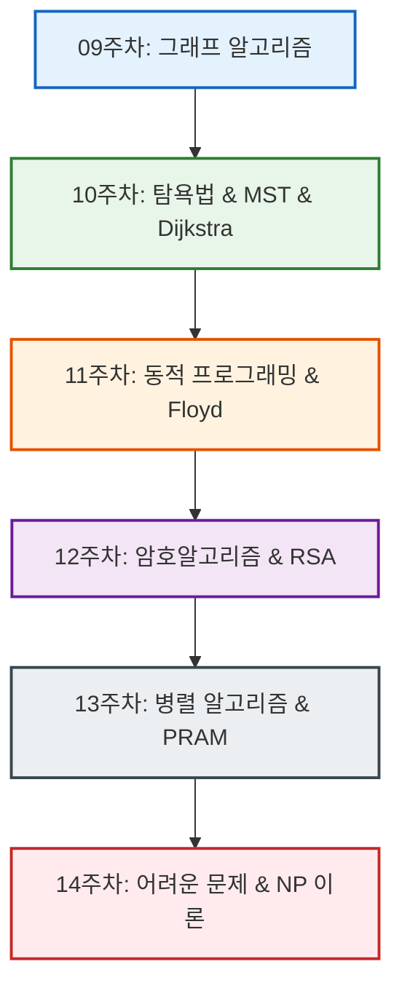

---

### 📂 [09주차] 그래프 알고리즘 (Graph Algorithms)

#### 0. 개념 계층 구조

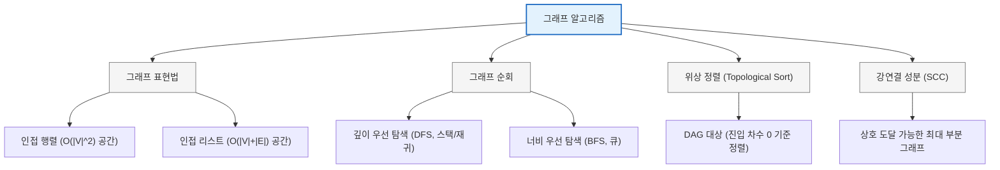

#### 1. 학문적 의의 및 개념

- **그래프 표현법의 선택**:
    - **인접 행렬 (Adjacency Matrix)**: $|V| \times |V|$ 크기의 2차원 배열. 두 정점의 연결 여부를 $O(1)$ 시간 만에 확인하는 장점이 있으나, 간선의 수가 적은 희소 그래프(Sparse Graph)에서는 메모리 낭비가 큽니다 ($O(|V|^2)$ 공간).
    - **인접 리스트 (Adjacency List)**: 각 정점에 연결된 인접 정점들을 연결 리스트로 표현. 메모리를 효율적으로 사용하지만 ($O(|V|+|E|)$ 공간), 두 정점 간의 연결 여부를 확인하려면 최대 $O(|V|)$의 탐색 시간이 걸립니다.
- **그래프 순회 (Traversal)**:
    - **DFS (깊이 우선 탐색)**: 방문한 정점의 인접한 정점 중 아직 방문하지 않은 깊은 쪽 정점을 먼저 탐색. **스택(Stack) 또는 재귀 호출**로 구현하며, 사이클 판단, 위상 정렬, 강연결 성분(SCC) 추출의 기초가 됩니다.
    - **BFS (너비 우선 탐색)**: 시작 정점으로부터 가까운 정점들을 먼저 차례대로 탐색. **큐(Queue)**를 사용하며, 가중치가 없는 그래프에서 **최단 경로**를 보장합니다.
- **위상 정렬 (Topological Sorting)**: 사이클이 없는 방향 그래프(DAG)에서 모든 정점을 간선 방향에 맞춰 나열하는 것. 선후 관계가 정의된 작업 순서 결정에 필수적입니다.
- **강연결 성분 (SCC)**: 방향 그래프에서 임의의 두 정점 $u, v$에 대해 $u \to v$와 $v \to u$ 경로가 모두 존재하는 최대 부분 그래프입니다.

#### 2. 표현법 및 탐색 특징 비교 표

| 비교 항목 | 인접 행렬 (Adjacency Matrix) | 인접 리스트 (Adjacency List) |
| --- | --- | --- |
| **공간 복잡도** | $O(|V|^2)$ | $O(|V| + |E|)$ |
| **간선 확인 시간** | $O(1)$ (예: `A[i][j] == 1`) | $O(degree(v))$ (리스트 순회) |
| **적합한 그래프** | 밀집 그래프 (Dense Graph, 간선이 많음) | 희소 그래프 (Sparse Graph, 간선이 적음) |
| **순회 구현** | DFS: 재귀/스택, BFS: 큐 | DFS: 재귀/스택, BFS: 큐 |

#### 3. 실전 예시 문제

> **Q. 정점이 $n$개인 완전그래프(Complete Graph)와 트리(Tree)의 간선 수는 각각 무엇인가? (2024 기출 2번)**

- **답**:
    - **완전그래프의 간선 수**: 모든 정점 쌍 사이에 간선이 존재하므로 $\frac{n(n-1)}{2}$ 개.
    - **트리의 간선 수**: 사이클이 없고 연결된 그래프이므로 항상 $n-1$ 개.

#### 4. DFS & BFS 탐색 시뮬레이션 과정 추적

아래의 예시 그래프를 기준으로 정점 **A**에서 출발하여 인접 정점을 **알파벳 순서**로 방문할 때의 DFS(깊이 우선 탐색)와 BFS(너비 우선 탐색)의 단계별 동작 과정을 추적합니다.

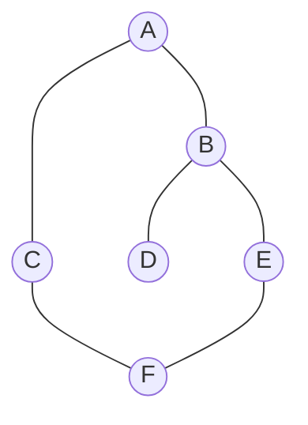

#### 1) DFS (깊이 우선 탐색) 추적: 재귀(재귀 스택) 방식

- **동작 원칙**: 방문할 수 있는 한 가장 깊게 탐색을 진행하고, 막히면 가장 최근 갈림길로 역추적(Backtrack)합니다.

| 단계 | 현재 정점 | 탐색 및 이동 과정 설명 | 방문 순서 (Visit Order) |
| --- | --- | --- | --- |
| **1** | **A** | A를 방문 처리하고, 인접 정점 B, C 중 알파벳 순서에 따라 **B**를 선택하여 이동 | `[A]` |
| **2** | **B** | B를 방문 처리하고, 인접 정점 A(방문됨), D, E 중 **D**를 선택하여 이동 | `[A, B]` |
| **3** | **D** | D를 방문 처리하고, 인접 정점 B(방문됨) 외에 미방문 정점이 없으므로 **B로 되돌아감(Backtrack)** | `[A, B, D]` |
| **4** | **B** | B에서 남은 미방문 인접 정점인 **E**를 선택하여 이동 | `[A, B, D]` |
| **5** | **E** | E를 방문 처리하고, 인접 정점 B(방문됨), F 중 **F**를 선택하여 이동 | `[A, B, D, E]` |
| **6** | **F** | F를 방문 처리하고, 인접 정점 C, E(방문됨) 중 **C**를 선택하여 이동 | `[A, B, D, E, F]` |
| **7** | **C** | C를 방문 처리하고, 인접 정점 A, F가 모두 방문된 상태이므로 **F로 되돌아감** | `[A, B, D, E, F, C]` |
| **8** | **F** | F에서 미방문 정점 없으므로 **E로 되돌아감** | `[A, B, D, E, F, C]` |
| **9** | **E** | E에서 미방문 정점 없으므로 **B로 되돌아감** | `[A, B, D, E, F, C]` |
| **10** | **B** | B에서 미방문 정점 없으므로 **A로 되돌아감** $\rightarrow$ A에서도 미방문 정점 없으므로 **종료** | `[A, B, D, E, F, C]` |

- 📌 **최종 DFS 방문 경로**: `**A ➔ B ➔ D ➔ E ➔ F ➔ C**`

---

#### 2) BFS (너비 우선 탐색) 추적: 큐(Queue) 자료구조 사용

- **동작 원칙**: 시작 정점으로부터의 거리가 가까운 정점들을 먼저 모두 방문(방문 표시 후 큐에 삽입)한 뒤 꺼냅니다.

| 단계 | 큐 (Queue) 상태 | 방문 정점 꺼냄 | 인접 정점 탐색 및 큐 삽입 (방문 처리) | 방문 순서 (Visit Order) |
| --- | --- | --- | --- | --- |
| **0** | `[A]` | - | 시작 정점 A를 큐에 넣고 방문 처리 | `[A]` |
| **1** | `[B, C]` | **A** | A의 인접 정점 중 미방문인 **B, C**를 차례로 큐에 넣고 방문 처리 | `[A, B, C]` |
| **2** | `[C, D, E]` | **B** | B의 인접 정점 중 미방문인 **D, E**를 차례로 큐에 넣고 방문 처리 | `[A, B, C, D, E]` |
| **3** | `[D, E, F]` | **C** | C의 인접 정점 중 미방문인 **F**를 큐에 넣고 방문 처리 | `[A, B, C, D, E, F]` |
| **4** | `[E, F]` | **D** | D의 인접 정점 중 미방문 정점 없음 | `[A, B, C, D, E, F]` |
| **5** | `[F]` | **E** | E의 인접 정점 중 미방문 정점 없음 | `[A, B, C, D, E, F]` |
| **6** | `[]` | **F** | F의 인접 정점 중 미방문 정점 없음 $\rightarrow$ 큐가 비어 **종료** | `[A, B, C, D, E, F]` |

- 📌 **최종 BFS 방문 경로**: `**A ➔ B ➔ C ➔ D ➔ E ➔ F**`

---

#### 5. 위상 정렬 (Topological Sorting) 개념 및 시뮬레이션

#### 1) 핵심 개념

- **정의**: 방향 그래프의 정점들을 간선의 방향을 거스르지 않도록(즉, 모든 간선 $(u, v)$에 대해 $u$가 $v$보다 먼저 나열되도록) 나열하는 정렬 방식입니다.
- **사용 목적**: 의존성 해결(Dependency Resolution), 작업 공정 순서 결정, 선수 과목 순서 계산 등.
- **필수 조건**: 반드시 **DAG(Directed Acyclic Graph, 사이클이 없는 방향 그래프)**여야 합니다.
    - **이유**: 그래프 내에 **사이클(Cycle)**이 존재하면 시작점을 정할 수 없고, 상호 의존 관계가 발생하므로 위상 정렬이 불가능합니다.
    - **특징**: 위상 정렬의 결과는 그래프에 따라 **여러 개가 존재**할 수 있습니다.

#### 2) 진입 차수(Indegree) 기반 알고리즘 (Kahn's Algorithm)

- **진입 차수(Indegree)**: 한 정점으로 들어오는 유향 간선의 개수.
- **알고리즘 흐름**:
    1. 그래프의 모든 정점의 진입 차수를 계산합니다.
    2. 진입 차수가 0인 모든 정점을 **큐(Queue)**에 넣습니다.
    3. 큐가 빌 때까지 다음 과정을 반복합니다.
        - 큐에서 정점 $u$를 꺼내 결과 리스트에 추가합니다.
        - $u$와 연결된 모든 인접 정점 $v$의 진입 차수를 1씩 감소시킵니다.
        - 이때 진입 차수가 0이 된 정점 $v$를 큐에 새로 삽입합니다.
    4. 모든 정점을 방문하기 전에 큐가 비었다면 **사이클이 존재**하는 것이고, 그렇지 않다면 결과 리스트가 위상 정렬된 순서입니다.

---

#### 3) 위상 정렬 시뮬레이션 추적

아래의 DAG 예시 그래프를 바탕으로 Kahn 알고리즘을 수행해 봅니다.

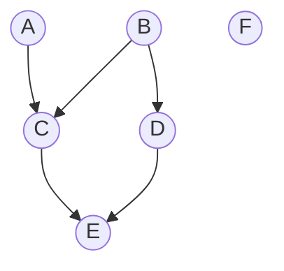

- **초기 진입 차수(Indegree) 설정**:
    - **A**: 0, **B**: 0, **F**: 0 (선수 조건이 없는 시작점들)
    - **C**: 2 (A, B에서 받음)
    - **D**: 1 (B에서 받음)
    - **E**: 2 (C, D에서 받음)

| 단계 | 현재 큐 (Queue) | 큐에서 꺼낸 정점 | 진입 차수(Indegree) 변화 및 인접 정점 처리 | 위상 정렬 결과 (Output) |
| --- | --- | --- | --- | --- |
| **0** | `[A, B, F]` | - | 진입 차수가 0인 정점 **A, B, F**를 큐에 넣고 시작 | `[]` |
| **1** | `[B, F]` | **A** | A의 인접 정점 C의 진입 차수 감소: **C(2 ➔ 1)** | `[A]` |
| **2** | `[F, C, D]` | **B** | B의 인접 정점 처리:<br>• C의 진입 차수 감소: **C(1 ➔ 0)** ➔ **큐 삽입**<br>• D의 진입 차수 감소: **D(1 ➔ 0)** ➔ **큐 삽입** | `[A, B]` |
| **3** | `[C, D]` | **F** | F는 인접 정점이 없으므로 변동 없음 | `[A, B, F]` |
| **4** | `[D]` | **C** | C의 인접 정점 E의 진입 차수 감소: **E(2 ➔ 1)** | `[A, B, F, C]` |
| **5** | `[E]` | **D** | D의 인접 정점 E의 진입 차수 감소: **E(1 ➔ 0)** ➔ **큐 삽입** | `[A, B, F, C, D]` |
| **6** | `[]` | **E** | E는 인접 정점이 없으므로 변동 없음 ➔ **큐가 비어 종료** | `[A, B, F, C, D, E]` |

- 📌 **최종 도출된 위상 정렬 순서**: `**A ➔ B ➔ F ➔ C ➔ D ➔ E**`
- 💡 **참고**: 이 그래프의 유효한 위상 정렬 순서는 이 외에도 `B ➔ D ➔ A ➔ C ➔ E ➔ F` 등 여러 가지가 존재합니다.

---

---

### 📂 [10주차] 탐욕법 & 최소신장나무 & 최단경로

#### 0. 개념 계층 구조

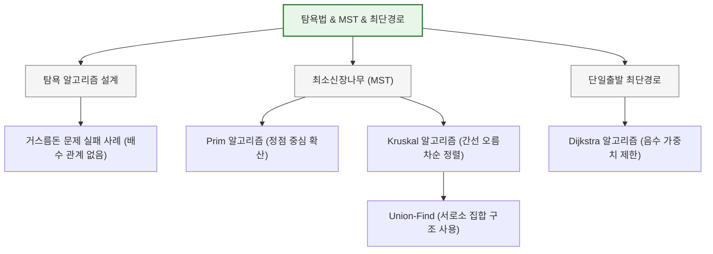

#### 1. 학문적 의의 및 개념

- **탐욕법 (Greedy Method)**: 매 순간 가장 최선으로 보이는 로컬(Local) 선택을 취함으로써 최종 해에 도달하는 기법. 설계가 매우 단순하고 빠르지만, 모든 문제에서 최적해(Global Optimal)를 보장하지는 않습니다.
- **최소신장나무 (MST)**: 그래프 내 모든 노드를 연결하면서 사이클이 없는 부분 그래프(트리) 중 간선 가중치의 합이 최소인 나무입니다.
    - **Prim 알고리즘**: 시작 정점만 포함된 집합 $U$에서 출발해, $U$에 속한 정점들과 인접한 외부 정점들 중 가장 가중치가 작은 간선을 선택하여 영역을 넓혀가는 방식(정점 중심).
    - **Kruskal 알고리즘**: 그래프의 모든 간선을 가중치 오름차순으로 정렬한 뒤, 사이클을 만들지 않는 간선을 순차적으로 선택하는 방식(간선 중심, 사이클 판별을 위해 Union-Find 구조 사용).
- **Dijkstra 알고리즘**: 음수 가중치가 없는 그래프에서 특정 단일 출발 정점으로부터 다른 모든 정점까지의 최단 거리를 구하는 알고리즘입니다.

#### 2. 그리디 최적해 실패 사례 (의의 이해 돕기)

> **Q. 거스름돈 동전의 종류가 **`**[12원, 10원, 5원, 1원]**`**이고, 거슬러 줄 금액이 **`**15원**`**인 경우 탐욕법이 최적해를 주지 못함을 보이시오.**

- **탐욕법의 선택**: 15원보다 작거나 같은 동전 중 가장 큰 12원을 먼저 선택 $\to$ 남은 3원에 대해 1원 3개 선택. **(동전 총 4개: 12원 1개, 1원 3개)**
- **실제 최적해**: 10원 1개, 5원 1개 선택. **(동전 총 2개)**
- **결론**: 동전의 단위가 배수 관계를 이루지 않으면 탐욕 알고리즘은 최적의 거스름돈 동전 개수를 보장하지 못합니다.

#### 3. 실전 예시 문제: Prim vs Kruskal 추적 (2025 기출 3번)

다음 그래프에서 정점 A를 시작으로 하는 Prim 알고리즘과 Kruskal 알고리즘의 간선 선택 순서를 추적하시오.

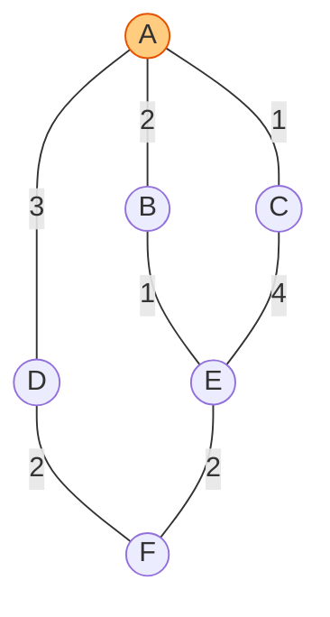

#### 1) Prim 알고리즘 (시작 정점: A)

7. 시작 정점 집합 $U = \{A\}$. 인접 간선 `A-C(1)`, `A-B(2)`, `A-D(3)` 중 최소 가중치인 `**A-C**`** (가중치 1)** 선택. ($U = \{A, C\}$)
8. 연결 가능한 간선 중 최소인 `**A-B**`** (가중치 2)** 선택. ($U = \{A, C, B\}$)
9. 연결 가능한 간선 중 최소인 `**B-E**`** (가중치 1)** 선택. ($U = \{A, C, B, E\}$)
10. 연결 가능한 간선 중 최소인 `**E-F**`** (가중치 2)** 선택. ($U = \{A, C, B, E, F\}$)
11. 연결 가능한 간선 중 최소인 `**F-D**`** (가중치 2)** 선택. ($U = \{A, C, B, E, F, D\}$)
- **간선 선택 순서**: `A-C` $\to$ `A-B` $\to$ `B-E` $\to$ `E-F` $\to$ `F-D`

#### 2) Kruskal 알고리즘 (간선 가중치 오름차순 정렬)

- 간선 후보 리스트: `A-C(1)`, `B-E(1)`, `A-B(2)`, `E-F(2)`, `F-D(2)`, `A-D(3)`, `C-E(4)`
12. `**A-C**`** (1)** 선택 (사이클 없음)
13. `**B-E**`** (1)** 선택 (사이클 없음)
14. `**A-B**`** (2)** 선택 (사이클 없음)
15. `**E-F**`** (2)** 선택 (사이클 없음)
16. `**F-D**`** (2)** 선택 (사이클 없음, 모든 노드 연결 완료!)
- **간선 선택 순서**: `A-C` $\to$ `B-E` $\to$ `A-B` $\to$ `E-F` $\to$ `F-D` (선택된 최종 트리 모양은 Prim과 동일하나 순서에 차이가 생김)

---

#### 4. 실전 예시 문제: Dijkstra 최단경로 추적 (2024 기출 3번)

시작 정점 `a`에서 출발하여 최단 경로를 구하는 Dijkstra 알고리즘의 동작 과정을 추적하시오.

| 단계 | 방문 정점($U$) | $D[a]$ | $D[b]$ | $D[c]$ | $D[d]$ | $D[e]$ | $D[f]$ | 선택된 최소 정점 |
| --- | --- | --- | --- | --- | --- | --- | --- | --- |
| **0** | $\{a\}$ | 0 | 1 | $\infty$ | 3 | $\infty$ | $\infty$ | $b$ (1) |
| **1** | $\{a, b\}$ | 0 | 1 | 5 | 2 | 6 | $\infty$ | $d$ (2) |
| **2** | $\{a, b, d\}$ | 0 | 1 | 4 | 2 | 4 | $\infty$ | $c$ (4) |
| **3** | $\{a, b, d, c\}$ | 0 | 1 | 4 | 2 | 4 | 6 | $e$ (4) |
| **4** | $\{a, b, d, c, e\}$ | 0 | 1 | 4 | 2 | 4 | 6 | $f$ (6) |
| **5** | $\{a, b, d, c, e, f\}$ | 0 | 1 | 4 | 2 | 4 | 6 | 종료 |

- **갱신 주요 수식**: $D[d] = \min(D[d], D[b] + A[b][d]) = \min(3, 1+1) = 2$

---

### 📂 [11주차] 동적 프로그래밍 (Dynamic Programming)

#### 0. 개념 계층 구조

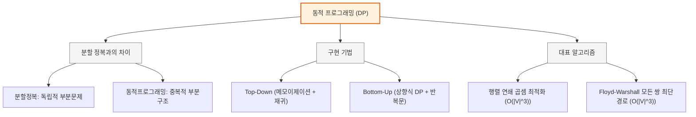

#### 1. 학문적 의의 및 개념

- **동적 프로그래밍 (DP)**: 문제를 부분 문제들로 쪼갠 뒤, 하위 문제의 해를 저장하는 테이블을 만들고 이를 상향식(Bottom-up)으로 조합해 나가면서 원래 문제를 해결하는 방식.
- **분할 정복(Divide & Conquer)과의 결정적 차이**:
    - **분할 정복**: 소문제들이 서로 완전히 독립적이며 중복되지 않음 (예: 합병 정렬).
    - **동적 프로그래밍**: 소문제들이 서로 겹치고 중복 호출됨 (예: 피보나치, 이항계수).

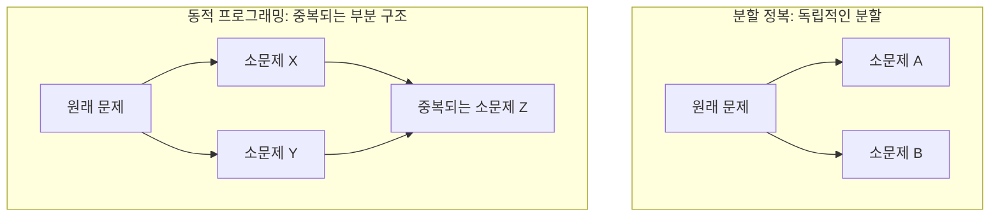

- **메모이제이션(Memoization) vs 상향식 DP(Bottom-Up)**:
    - **Memoization (Top-Down)**: 위에서 아래로 재귀 호출을 수행하되, 계산 결과가 이미 캐시에 존재하면 재귀를 타지 않고 즉시 반환하는 방식.
    - **Bottom-Up (DP)**: 반복문(Loop)을 이용하여 가장 작은 밑바닥 부분 문제부터 값을 채워나가는 방식.

---

#### 2. 실전 예시 문제: 행렬 연쇄 곱셈 DP 계산 (2024 기출 5번)

> **Q. 행렬 $A_1(3\times5)$, $A_2(5\times2)$, $A_3(2\times10)$, $A_4(10\times2)$를 연쇄 곱할 때, 연산 횟수의 최솟값 표 $M$과 최적 분할점 표 $P$를 완성하고 최적 괄호 순서를 쓰시오.**

#### 1) 점화식

$$M[i][j] = \min_{i \le k < j} (M[i][k] + M[k+1][j] + d_{i-1} \cdot d_k \cdot d_j)$$

- 행렬 차원 수열: $d = [3, 5, 2, 10, 2]$

#### 2) $M$ 테이블 (최소 연산 횟수)

| $i \backslash j$ | 1 | 2 | 3 | 4 |
| --- | --- | --- | --- | --- |
| **1** | 0 | 30 | 90 | **82** |
| **2** | - | 0 | 100 | 60 |
| **3** | - | - | 0 | 40 |
| **4** | - | - | - | 0 |

#### 3) $P$ 테이블 (최적 분할점 $k$)

| $i \backslash j$ | 1 | 2 | 3 | 4 |
| --- | --- | --- | --- | --- |
| **1** | - | 1 | 2 | **2** |
| **2** | - | - | 2 | 2 |
| **3** | - | - | - | 3 |
| **4** | - | - | - | - |

#### 4) 주요 계산 과정 예시

- **$M[1][3]$ 계산 (k = 1, 2 중 최소)**:
    - $k=1: M[1][1] + M[2][3] + d_0 d_1 d_3 = 0 + 100 + (3 \times 5 \times 10) = 250$
    - $k=2: M[1][2] + M[3][3] + d_0 d_2 d_3 = 30 + 0 + (3 \times 2 \times 10) = 90$
    - 최솟값은 **90**, 이때 최적의 $k$는 **2**.
- **$M[1][4]$ 계산 (k = 1, 2, 3 중 최소)**:
    - $k=1: M[1][1] + M[2][4] + d_0 d_1 d_4 = 0 + 60 + (3 \times 5 \times 2) = 90$
    - $k=2: M[1][2] + M[3][4] + d_0 d_2 d_4 = 30 + 40 + (3 \times 2 \times 2) = 82$
    - $k=3: M[1][3] + M[4][4] + d_0 d_3 d_4 = 90 + 0 + (3 \times 10 \times 2) = 150$
    - 최솟값은 **82**, 이때 최적의 $k$는 **2**.
- **최적의 괄호 묶기 순서**:
    - $P[1][4] = 2$ 이므로 $(A_1 A_2) \times (A_3 A_4)$
    - 최종 답: **$(A_1 \times A_2) \times (A_3 \times A_4)$**

---

#### 3. 실전 예시 문제: Floyd 알고리즘 표 채우기 (2025 기출 2번)

> **Q. 아래 가중치 행렬 $W(d^{(0)})$에서 시작하여 Floyd 알고리즘을 수행할 때, 각 단계의 매트릭스 빈칸을 채우시오.**
$$W = d^{(0)} = \begin{pmatrix} 0 & 5 & 1 & 4 \\ 2 & 0 & 1 & 7 \\ 1 & \infty & 0 & 1 \\ \infty & 2 & 5 & 0 \end{pmatrix}$$

- **$d^{(1)}$ (1번 정점 경유)**:
    - $d^{(1)}*{24} = \min(d^{(0)}*{24}, d^{(0)}*{21} + d^{(0)}*{14}) = \min(7, 2+4) = \mathbf{6}$
    - $d^{(1)}*{32} = \min(d^{(0)}*{32}, d^{(0)}*{31} + d^{(0)}*{12}) = \min(\infty, 1+5) = \mathbf{6}$
- **$d^{(2)}$ (2번 정점 경유)**:
    - $d^{(2)}*{41} = \min(d^{(1)}*{41}, d^{(1)}*{42} + d^{(1)}*{21}) = \min(\infty, 2+2) = \mathbf{4}$
    - $d^{(2)}*{43} = \min(d^{(1)}*{43}, d^{(1)}*{42} + d^{(1)}*{23}) = \min(5, 2+1) = \mathbf{3}$
- **$d^{(3)}$ (3번 정점 경유)**:
    - $d^{(3)}*{14} = \min(d^{(2)}*{14}, d^{(2)}*{13} + d^{(2)}*{34}) = \min(4, 1+1) = \mathbf{2}$
    - $d^{(3)}*{24} = \min(d^{(2)}*{24}, d^{(2)}*{23} + d^{(2)}*{34}) = \min(6, 1+1) = \mathbf{2}$

최종 테이블 $d^{(3)}$:
$$d^{(3)} = \begin{pmatrix} 0 & 5 & 1 & \mathbf{2} \\ 2 & 0 & 1 & \mathbf{2} \\ 1 & \mathbf{6} & 0 & 1 \\ \mathbf{4} & 2 & \mathbf{3} & 0 \end{pmatrix}$$

---

### 📂 [12주차] 암호 알고리즘 (Cryptographic Algorithms)

#### 0. 개념 계층 구조

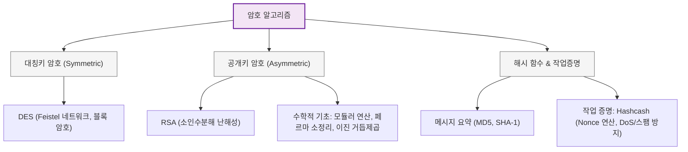

#### 1. 학문적 의의 및 개념

- **대칭키 vs 공개키 암호 시스템**:
    - **대칭키 (Symmetric)**: 송수신자가 동일한 비밀키를 공유. 연산이 빠르지만 키 분배가 까다로움 (예: DES - Feistel 네트워크 기반 블록 암호).
    - **공개키 (Asymmetric)**: 송신자는 공개키(Public Key)로 암호화하고 수신자는 개인키(Private Key)로 복호화. 키 관리가 용이하지만 연산 속도가 느림 (예: RSA - 소인수분해 난해성 기반).
- **해시 함수 (Hash Function)**: 임의의 메시지를 고정 길이의 메시지 요약(Digest)으로 변환하는 단방향 함수.
- **Hashcash와 작업 증명 (PoW)**: 이메일 전송 시 헤더에 특정 해시 조건(예: 앞에 $k$개의 0을 갖는 SHA 해시값)을 만족하는 nonce 값을 찾아 적도록 강제하는 기법. CPU 연산 자원을 소모하게 만들어 스팸 및 DoS 공격을 방지하며, 이후 블록체인 PoW(Proof of Work)의 근간이 됩니다.

---

#### 2. 실전 예시 문제: 모듈러 계산 및 RSA 복호화

> **Q1. 계산기를 사용하지 않고 $15^{265} \pmod{13}$의 값을 구하시오. (2024 기출 6번)**

- **의의**: 지수가 매우 클 때는 페르마의 소정리(Fermat's Little Theorem)를 이용하여 간소화합니다.
- **풀이 과정**:
    1. 밑 정리: $15 \equiv 2 \pmod{13}$ 이므로, $15^{265} \equiv 2^{265} \pmod{13}$ 입니다.
        1. 지수 축소: $265 = 12 \times 22 + 1$ 이므로,
$$2^{265} = (2^{12})^{22} \times 2^1 \equiv 1^{22} \times 2 \equiv \mathbf{2} \pmod{13}$$
    2. 페르마의 소정리 적용: 13은 소수이므로, $2^{12} \equiv 1 \pmod{13}$ 이 성립합니다.
- **정답**: **2**

> **Q2. 공개키가 $\{3, 55\}$이고 개인키가 $\{27, 55\}$인 RSA 시스템에서 암호문 $C = 20$이 수신되었다. 이를 복호화하여 평문 $A$를 구하시오. (2025 기출 6번)**

- **의의**: 복호화 공식은 $A = C^d \pmod n$ 입니다. 즉, $A = 20^{27} \pmod{55}$를 구해야 합니다.
- **풀이 과정 (이진 거듭제곱법)**:
    1. 지수 이진수 변환: $27 = 16 + 8 + 2 + 1 = 11011_{(2)}$
    2. $20$의 $2^k$승들의 모듈러 연산 ($n=55$):
        - $20^1 \equiv \mathbf{20} \pmod{55}$
        - $20^2 = 400 = (55 \times 7) + 15 \equiv \mathbf{15} \pmod{55}$
        - $20^4 = (20^2)^2 \equiv 15^2 = 225 = (55 \times 4) + 5 \equiv \mathbf{5} \pmod{55}$
        - $20^8 = (20^4)^2 \equiv 5^2 = \mathbf{25} \pmod{55}$
        - $20^{16} = (20^8)^2 \equiv 25^2 = 625 = (55 \times 11) + 20 \equiv \mathbf{20} \pmod{55}$
    3. 필요한 요소들의 곱셈 조합:
$$20^{27} = 20^{16} \times 20^8 \times 20^2 \times 20^1 \pmod{55}$$
        - 먼저 앞의 두 개 곱: $20 \times 25 = 500 \equiv 5 \pmod{55}$ (∵ $500 = 55 \times 9 + 5$)
        - 뒤의 두 개 곱: $15 \times 20 = 300 \equiv 25 \pmod{55}$ (∵ $300 = 55 \times 5 + 25$)
        - 최종 연산: $5 \times 25 = 125 \equiv \mathbf{15} \pmod{55}$ (∵ $125 = 55 \times 2 + 15$)
- **정답**: **15**

---

### 📂 [13주차] 병렬 알고리즘 (Parallel Algorithms)

#### 0. 개념 계층 구조

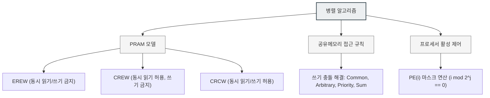

#### 1. 학문적 의의 및 개념

- **PRAM (Parallel Random Access Machine) 모델**: 여러 개의 프로세서가 하나의 커다란 공유 메모리를 이용해 동시에 연산을 수행하는 가상의 병렬 컴퓨팅 모델입니다.
- **메모리 동시 접근 모드**:
    1. **EREW**: 동시 읽기 불가능, 동시 쓰기 불가능 (가장 제한적).
    2. **CREW**: 동시 읽기 가능, 동시 쓰기 불가능 (현실적인 모델).
    3. **CRCW**: 동시 읽기 가능, 동시 쓰기 가능 (가장 강력함).
- **CRCW의 동시 쓰기 규칙**:
    - **Common**: 프로세서가 모두 동일한 값을 쓰려고 할 때만 쓰기 허용.
    - **Arbitrary**: 임의의 프로세서 하나만 쓰기 성공.
    - **Priority**: 우선순위가 가장 높은 프로세서의 값만 기록됨.
    - **Sum**: 동시 쓰기를 시도한 모든 값의 **합(Sum)**이 메모리에 저장됨. (24년 기출)

---

#### 2. 실전 예시 문제: 프로세서 동작 조건의 이해 (2025 기출 4번)

> **Q. PRAM 병렬 알고리즘 코드에서 다음과 같은 조건이 적혀 있다. 이 조건문이 의미하는 바는 무엇인가?**`A[2i] = min(A[2i], A[2i + 2j]), {PE(i) : i mod 2j == 0};`

- **의의**: 각 단계마다 활성화되어 일할 프로세서(PE)들을 지정하는 동기화 마스크 연산입니다.
- **해석**:
    - $i$번 프로세서($PE(i)$)는 자신의 인덱스 $i$가 $2^j$의 배수일 때만 해당 조건문 코드를 수행합니다.
    - 예: $j=1$일 때는 짝수 번호 프로세서($PE(0), PE(2), PE(4), \dots$)만 활성화되어 동작하고, 홀수 번호 프로세서들은 아무 일도 하지 않고 쉬게 됩니다. (매 단계마다 활성 프로세서 수가 반씩 줄어드는 토너먼트 연산에 주로 사용됨)

---

### 📂 [14주차] 어려운 문제 & NP 이론 (Intractable Problems)

#### 0. 개념 계층 구조

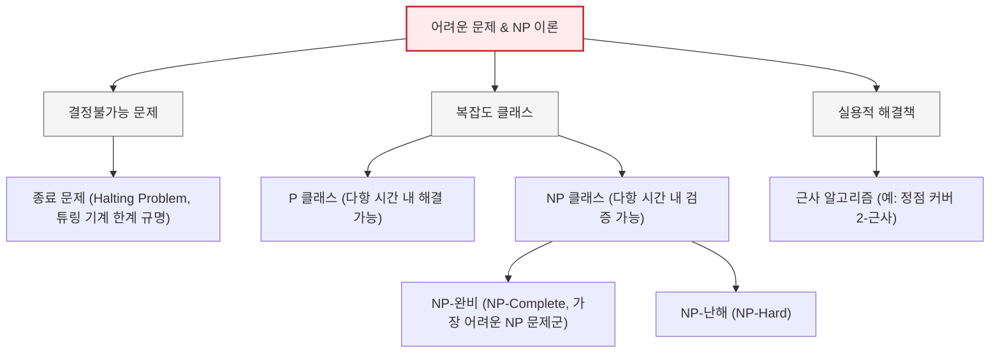

#### 1. 학문적 의의 및 개념

- **종료 문제 (Halting Problem)**: 임의의 프로그램 P가 어떤 입력 I를 받았을 때 정상 종료할지 무한 루프에 빠질지를 판별하는 만능 프로그램 H가 존재하는가?
    - **의의**: 컴퓨터 과학 최초로 **기계(컴퓨터)로 결코 해결할 수 없음**을 수학적으로 완벽히 증명한 결정불가능(Undecidable) 문제 (Alan Turing, 1936).
- **복잡도 클래스 P vs NP**:
    - **클래스 P**: 결정적 튜링 머신(현실 컴퓨터)으로 **다항 시간 (Polynomial Time)** 내에 답을 찾을 수 있는 문제들의 집합. (쉬운 문제)
    - **클래스 NP**: 비결정적 알고리즘으로 다항 시간 내에 해를 찾거나, 주어진 해가 올바른지 **다항 시간 내에 검증(Verify)**할 수 있는 문제들의 집합. (어려운 문제 포함)
    - **P = NP?**: "다항 시간 내에 검증할 수 있는 모든 문제는 다항 시간 내에 답을 찾을 수도 있는가?"라는 밀레니엄 미해결 난제.

#### 2. P, NP 복잡도 영역 다이어그램

```mermaid
graph TD
    subgraph P_not_equal_NP [P ≠ NP일 때의 범주 (정설)]
        NP_Hard[NP-난해: NP-Hard]
        NP_Complete[NP-완비: NP-Complete]
        NP_Class[NP 클래스]
        P_Class[P 클래스]

        NP_Hard --> NP_Complete
        NP_Complete -.-> NP_Class
        P_Class -.-> NP_Class
    end
```

- **NP-완비 (NP-Complete)**: NP 문제군 중에서 **가장 어려운 문제들**의 집합. 만약 NP-완비에 속하는 문제 중 단 하나라도 다항 시간 내에 푸는 방법을 찾아낸다면, 모든 NP 문제를 다항 시간에 풀 수 있게 됩니다 ($P=NP$가 됨).
- **근사 알고리즘 (Approximation Algorithm)**: NP-완비처럼 현실적인 시간 내에 최적해를 구하기 힘든 경우, 최적은 아니지만 거의 최적에 가까운 해(예: 최적해의 최대 2배 이내 보장)를 다항 시간 내에 구해내는 실용적인 타협안입니다.

---

#### 3. 실전 예시 문제: 정점 커버 (Vertex Cover) 근사 알고리즘

> **Q. 아래 정점 커버 근사 알고리즘이 "2-근사 알고리즘" (최적해 크기의 최대 2배 크기만 가지는 정점 커버를 반환함)이 되는 원리를 적으시오.**

```plain text
Approx-Vertex-Cover(G):
  C = empty_set
  E_prime = G.E
  while E_prime is not empty:
    let (u, v) be an arbitrary edge in E_prime
    C = C U {u, v}
    remove from E_prime any edge incident on u or v
  return C
```

- **의의**: 매 단계마다 아직 커버되지 않은 간선 $(u, v)$를 임의로 하나 고른 뒤, **두 정점 $u$와 $v$를 모두** 결과 집합 $C$에 추가하고, 이 정점들과 연결된 모든 간선을 그래프에서 지워버립니다.
- **2-근사의 원리**:
    1. 알고리즘이 선택한 간선들의 집합을 $M$이라고 합시다. 이 간선들은 서로 정점을 공유하지 않으므로 독립적인 매칭(Matching)을 이룹니다.
    2. $M$에 속한 간선들을 모두 커버하려면 최적의 정점 커버(Optimal Cover, $C^*$)도 각 간선당 ****최소한 1개****의 정점은 반드시 선택해야 하므로, $\|C^*\| \ge \|M\|$ 입니다.
    3. 그러나 본 알고리즘은 매 간선마다 정점을 **2개씩** ($u, v$ 모두) 추가하므로, 최종 결과의 크기는 $\|C\| = 2\|M\|$ 입니다.
    4. 따라서 $\|C\| = 2\|M\| \le 2\|C^*\|$ 가 성립하므로, 우리가 구한 정점 커버의 크기는 절대 최적해 크기의 2배를 넘지 않습니다.

---
## 세부 파일: 기말 목차

## 🎓 알고리즘 기말고사 대비 핵심 요약 및 목차

이 문서는 09주차부터 14주차까지의 알고리즘 강의 자료와 최근 2개년(2024년, 2025년) 기말고사 기출문제를 완벽하게 분석하여 작성된 시험 대비 가이드 및 목차입니다.

---

### 📌 기말고사 범위 및 기출 경향 요약

> [!NOTE]
> **시험 범위**: 09주차 ~ 14주차 강의 자료
> 
> **기출 특징**:
> 1. 매년 **단답형/용어 설명 문제**(각 2점씩 6~7문항)가 높은 비중으로 출제됩니다. (주로 각 주차의 핵심 정의)
> 2. 알고리즘의 동작 과정을 단계별로 추적하고 표를 채우거나 그래프에 표시하는 **서술/추적 문제**가 단골로 출제됩니다. (Dijkstra, Floyd, Prim/Kruskal, 행렬 연쇄곱 DP 표)
> 3. **수학적 연산**이 포함된 암호학 문제(모듈러 거듭제곱, RSA 복호화)는 직접 손으로 푸는 과정을 기술해야 합니다.
> 4. 병렬 알고리즘(PRAM) 및 복잡도(NP) 이론의 핵심 개념을 묻는 질문이 반드시 출제됩니다.

---

### 📅 주차별 핵심 목차 및 기출 연계 분석

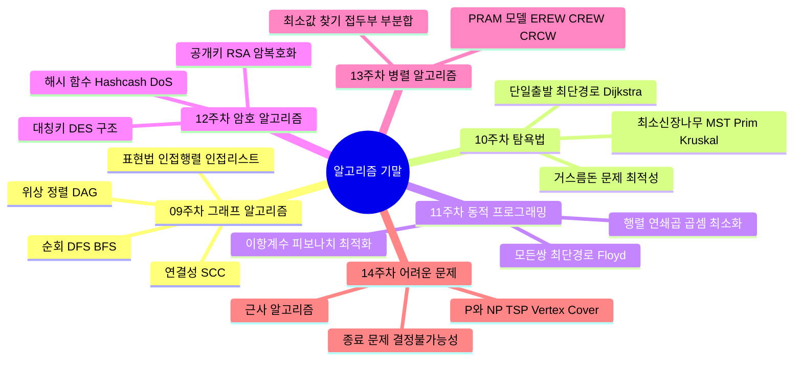

---

#### 📂 [09주차] 그래프 알고리즘 (Graph Algorithms)

- **핵심 개념**:
    - 그래프의 표현법: 인접 행렬(Adjacency Matrix, $O(|V|^2)$ 공간) vs 인접 리스트(Adjacency List, $O(|V|+|E|)$ 공간).
    - 그래프 순회: DFS(깊이 우선 탐색 - 스택/재귀 사용) 및 BFS(너비 우선 탐색 - 큐 사용).
    - 위상 정렬(Topological Sorting): 사이클이 없는 방향 그래프(DAG)에서 간선 방향을 거스르지 않도록 정점을 나열.
    - 연결 성분(Connected Component) & 강연결 성분(SCC): 방향 그래프에서 모든 정점 쌍 간에 상호 도달 가능한 최대 부분 그래프.
- **📝 기출 연계**:
    - **2025년 1번 (1)**: **그래프의 인접행렬 표현법** 정의 설명 (밀집 그래프(dense graph)에 적절함).
    - **2024년 1번 (1)**: **깊이우선탐색(DFS)** 정의 설명 (가장 최근 방문 정점에 인접한 정점을 먼저 방문, 스택 구현).
    - **2025년 1번 (2)**: **너비우선탐색(BFS)** 정의 설명 (가장 오래전에 방문한 정점의 주변 정점부터 방문, 거리 순, 큐 구현).
    - **2025년 1번 (3)**: **위상정렬(Topological Sorting)** 정의 설명 (DAG에서 방향 간선이 한 방향으로만 향하도록 정점을 나열, 작업 순서 결정에 유용).
    - **2025년 1번 (4)**: **강연결 성분(SCC)** 정의 설명 (방향 그래프에서 서로 접근할 수 있는 경로가 모든 정점쌍간에 존재하는 최대 부분 그래프).
    - **2024년 2번 (1)**: 정점이 $n$개인 **완전그래프의 간선 수** 구하기 ($\frac{n(n-1)}{2}$).
    - **2024년 2번 (2)**: 정점이 $n$개인 **트리의 간선 수** 구하기 ($n-1$).

---

#### 📂 [10주차] 탐욕법 (Greedy Method)

- **핵심 개념**:
    - 탐욕 알고리즘 설계 기법: 그 순간의 최적 선택(local optimal)이 전체 최적해(global optimal)를 보장하는 경우 사용.
    - 거스름돈 문제: 특정 동전 체계(예: 12원 동전 도입 시)에서는 탐욕법이 최적해를 구하지 못할 수 있음.
    - 최소신장나무(MST): 가중치 무방향 그래프에서 모든 정점을 연결하는 트리 중 간선 가중치의 합이 최소인 트리.
    - MST 알고리즘: Prim 알고리즘(정점 기반 확산), Kruskal 알고리즘(간선 가중치 정렬 후 사이클 비허용 연결).
    - 최단 경로: 단일 출발점 최단 경로 알고리즘인 Dijkstra 알고리즘 (음수 가중치가 없어야 함).
- **📝 기출 연계**:
    - **2024년 1번 (2)**: **최소신장나무(MST)** 정의 설명 (모든 노드를 포함하는 연결 부분그래프 중 나무이면서 가중치 합이 가장 작은 것).
    - **2025년 3번**: 주어진 그래프에서 **Prim**과 **Kruskal** 알고리즘을 사용한 MST 생성 과정(선택되는 간선 순서 기입).
    - **2024년 3번**: **Dijkstra** 알고리즘을 이용한 단일출발점 최단경로 테이블 및 정점 선택 추적.

---

#### 📂 [11주차] 동적 프로그래밍 (Dynamic Programming)

- **핵심 개념**:
    - DP 설계 기법: 문제를 소문제로 분할하되 중복 계산을 방지하기 위해 상향식(Bottom-up)으로 해결하거나 메모이제이션(Memoization)을 적용.
    - 이항 계수(Binomial Coefficient) & 피보나치 수열: 단순 재귀 호출의 비효율성을 지적하고 DP/메모이제이션으로 해결하는 대표 사례.
    - 행렬 연쇄 곱셈(Matrix Chain Multiplication): 행렬 곱셈 순서에 따라 연산 횟수가 달라지며, 이를 최소화하는 최적 순서를 DP를 통해 계산.
    - 모든 쌍 최단 경로: Floyd-Warshall 알고리즘 ($O(|V|^3)$ 시간 복잡도, 동적 프로그래밍 기반).
- **📝 기출 연계**:
    - **2024년 4번**: 이항계수 재귀 알고리즘의 **비효율성 원인** 및 **개선 방안 2가지**(메모화, 동적 프로그래밍) 서술.
    - **2025년 5번**: 피보나치 재귀 알고리즘의 **비효율성 원인** 및 **개선 방안 2가지**(메모화, 동적 프로그래밍) 서술.
    - **2024년 5번**: 4개 행렬의 연쇄곱 최소 연산 횟수 표($M$) 및 분할 기준 표($P$) 완성하고 최적 괄호 순서 도출.
    - **2025년 7번**: 5개 행렬의 연쇄곱 최소 연산 횟수 표($M$) 및 분할 기준 표($P$) 완성하고 최적 괄호 순서 도출.
    - **2025년 2번**: **Floyd** 알고리즘을 이용한 모든 쌍 최단경로 전이 테이블($d^{(0)}$부터 $d^{(3)}$까지) 빈칸 채우기.

---

#### 📂 [12주차] 암호 알고리즘 (Cryptographic Algorithms)

- **핵심 개념**:
    - 암호학 기초 용어: 평문, 암호문, 암호화/복호화 키.
    - 대칭키 암호(Symmetric-Key): 암호화와 복호화에 동일한 키 사용 (예: DES - 블록 암호, S-Box를 통한 6비트->4비트 축소 등).
    - 공개키 암호(Public-Key): 송신자는 수신자의 공개키로 암호화하고, 수신자는 자신의 비밀키(개인키)로 복호화 (예: RSA).
    - 수학적 기초: 최대공약수(gcd), 모듈러 산술 연산(덧셈, 곱셈, 음수 역원, 곱셈 역원).
    - 메시지 요약(Message Digest): 해시 함수(MD5, SHA-1)를 이용하여 고정 길이의 요약값 생성. 일방향성 및 충돌 회피성 필요.
    - 작업 증명(PoW): Adam Back의 Hashcash(해시캐시) 시스템 (스팸메일 방지를 위해 특정 조건의 해시값을 찾는 과정).
- **📝 기출 연계**:
    - **2024년 1번 (4)**: **공개키 암호시스템** 정의 설명 (한 쌍의 키(공개키, 비밀키)를 사용하며, 공개키는 누구나 알 수 있고 비밀키는 개인만 간직하는 암호 시스템).
    - **2025년 1번 (5)**: 아담 백(Adam Back)의 **해시캐시(hashcash)** 정의 설명 (스팸메일과 DoS 공격을 방지하기 위해 도입되었으며, 작업증명(PoW) 시스템의 근간이 됨).
    - **2024년 6번**: 손으로 푸는 **모듈러 거듭제곱 계산** ($15^{265} \pmod{13}$).
    - **2025년 6번**: **RSA 복호화 계산** (공개키 $\{3, 55\}$, 개인키 $\{27, 55\}$, 암호문 $20$일 때 평문 $A = 20^{27} \pmod{55}$ 구하기).
    - **2024년 7번**: 사용자 정의 메시지 요약 알고리즘 (연산 $\oplus$ 규칙 정의: $a \oplus b = (a \cdot b) \pmod 7$) 추적 문제.

---

#### 📂 [13주차] 병렬 알고리즘 (Parallel Algorithms)

- **핵심 개념**:
    - PRAM(Parallel Random Access Machine) 모델: 공유 메모리를 가진 동기식 병렬 계산 모델.
    - 메모리 접근 규칙: EREW(동시 읽기/쓰기 금지), CREW(동시 읽기 허용/동시 쓰기 금지), CRCW(동시 읽기/쓰기 모두 허용).
    - CRCW의 쓰기 충돌 해결 규칙: Common, Arbitrary, Priority, Sum(프로세서들이 쓰려는 값들의 합을 저장).
    - 주요 병렬 알고리즘:
        - 최소값 찾기: 순차적으로는 $O(n)$이나 CREW PRAM을 이용하면 $O(\log n)$ 시간에 해결 가능 (프로세서 $\frac{n}{2}$개 사용).
        - 접두부 부분합(Prefix Sum): $O(\log n)$ 시간에 부분합 배열 구축.
        - 병렬 행렬 곱셈.
- **📝 기출 연계**:
    - **2024년 1번 (6)**: PRAM 모델의 병렬쓰기규칙 중 **sum 규칙** 정의 설명 (여러 프로세서가 동시에 같은 메모리에 쓸 때, 그 값들의 합을 저장하는 방식).
    - **2024년 8번**: CREW PRAM 모델 기반의 **최소값 찾기 알고리즘(FooBar)** 실행 결과 배열 추적.
    - **2025년 4번**: 병렬 알고리즘 코드 내 조건문 `{PE(i) : i mod 2^j == 0}`이 의미하는 **활성 프로세서 동작 조건** 서술.

---

#### 📂 [14주차] 어려운 문제 (Intractable Problems)

- **핵심 개념**:
    - 결정불가능 문제(Undecidable Problem): 기계적으로 해결할 수 없는 문제 (예: Alan Turing의 종료 문제(Halting Problem)).
    - 다루기 쉬운 문제(Tractable) vs 다루기 어려운 문제(Intractable): 다항 시간(Polynomial)에 해결 가능한지 여부.
    - 클래스 P: 결정적 튜링 머신으로 다항 시간 내에 해결 가능한 문제들의 집합.
    - 클래스 NP: 비결정적 알고리즘으로 다항 시간 내에 해결 가능한(또는 다항 시간 내에 해의 정당성을 검증할 수 있는) 문제들의 집합.
    - P vs NP 문제: “NP에 속한 모든 문제가 P에 속하는가? (실제 P=NP 인가?)”라는 미해결 컴퓨터 공학 난제.
    - 대표적인 NP-난제(NP-Hard/Complete): 외판원 문제(TSP), CNF-SAT(논리식 만족), 배낭 문제(Knapsack), 정점 커버 문제(Vertex Cover).
    - 실용적 해결책: 근사 알고리즘(Approximation Algorithm) 설계 (최적해에 가까운 해를 다항 시간에 구함).
- **📝 기출 연계**:
    - **2024년 1번 (5)**: **P=NP?** 질문의 의미 서술 (NP 문제들이 실제로는 P인데 우리가 풀지 못한 것인지, 본질적으로 다른 종류인지 묻는 질문).
    - **2025년 1번 (6)**: **NP(Nondeterministic Polynomial) 문제** 정의 설명 (비결정적 컴퓨터에서 다항시간에 풀 수 있는 문제들).
    - **2025년 1번 (7)**: **종료 문제(Halting Problem)** 정의 설명 (어떤 프로그램 P가 정상적으로 종료할지를 결정하는 문제로, 기계적으로 해결 불가능함이 증명됨).

---

### ✍️ 유형별 대표 기출문제 풀이 가이드

> [!TIP]
> 아래 문제들은 기말고사에서 점수 배점이 가장 크고 오답률이 높은 연산 및 알고리즘 추적 유형입니다. 확실하게 풀이법을 숙지하세요.

#### 1️⃣ Dijkstra 알고리즘 추적 (2024년 기출 3번)

- **핵심 공식**: $D[v] = \min(D[v], D[w] + A[w][v])$
- **풀이 순서**:
    1. 시작 정점 $s$를 방문 정점 집합 $U$에 넣고, $s$의 인접 정점 가중치로 거리 배열 $D$를 초기화합니다.
    2. $V - U$ (아직 방문하지 않은 정점) 중에서 $D$ 값이 가장 작은 정점 $w$를 선택하여 $U$에 추가합니다.
    3. $w$에 인접한 모든 정점 $v$에 대해 위의 공식으로 최단거리를 갱신합니다.
    4. 모든 정점을 방문할 때까지 2~3 과정을 반복합니다.

#### 2️⃣ Floyd 알고리즘 표 채우기 (2025년 기출 2번)

- **핵심 점화식**: $d^{(k)}_{ij} = \min(d^{(k-1)}_{ij}, d^{(k-1)}_{ik} + d^{(k-1)}_{kj})$
- **단계별 갱신 포인트 (**$W = d^{(0)}$**에서 출발)**:
    - $d^{(1)}$** (1번 정점 경유)**: 1행과 1열은 변하지 않음. 다른 칸 중 `(row, 1) + (1, col)`의 합이 기존 값보다 작으면 갱신.
        - 예: $d^{(1)}_{24} = \min(d^{(0)}_{24}, d^{(0)}_{21} + d^{(0)}_{14}) = \min(7, 2+4) = 6$
        - 예: $d^{(1)}_{32} = \min(d^{(0)}_{32}, d^{(0)}_{31} + d^{(0)}_{12}) = \min(\infty, 1+5) = 6$
    - $d^{(2)}$** (2번 정점 경유)**: 2행과 2열은 변하지 않음. 타 정점 경유 경로 갱신.
        - 예: $d^{(2)}_{41} = \min(d^{(1)}_{41}, d^{(1)}_{42} + d^{(1)}_{21}) = \min(\infty, 2+2) = 4$
        - 예: $d^{(2)}_{43} = \min(d^{(1)}_{43}, d^{(1)}_{42} + d^{(1)}_{23}) = \min(5, 2+1) = 3$
    - $d^{(3)}$** (3번 정점 경유)**: 3행과 3열 변하지 않음.
        - 예: $d^{(3)}_{14} = \min(d^{(2)}_{14}, d^{(2)}_{13} + d^{(2)}_{34}) = \min(4, 1+1) = 2$
        - 예: $d^{(3)}_{24} = \min(d^{(2)}_{24}, d^{(2)}_{23} + d^{(2)}_{34}) = \min(6, 1+1) = 2$

#### 3️⃣ 행렬 연쇄 곱셈 DP 테이블 계산 (2024년 5번, 2025년 7번)

- **핵심 점화식**: $M[i][j] = \min_{i \le k < j} (M[i][k] + M[k+1][j] + d_{i-1} \cdot d_k \cdot d_j)$
- **최적 분할점**: 최소 곱셈 횟수를 만족하게 한 $k$의 값을 $P[i][j]$에 기록.
- **풀이 요령**:
    - 테이블의 대각선 방향으로 채워나갑니다 ($j-i = 1 \to 2 \to 3 \to \dots$).
    - 괄호 묶기 순서는 $P[1][n]$의 값을 기준으로 크게 두 그룹으로 쪼갠 뒤, 하위 그룹도 동일하게 쪼갭니다.
        - 예 (2024년 4개 행렬): $P[1][4]=2$이므로 $(A_1 A_2) \times (A_3 A_4)$로 크게 쪼개지며, 최종 순서는 `(A1 × A2) × (A3 × A4)`가 됩니다.
        - 예 (2025년 5개 행렬): $P[1][5]=1$이므로 $A_1 \times (A_2 A_3 A_4 A_5)$로 쪼개지고, $P[2][5]=4$이므로 후반부가 $(A_2 A_3 A_4) \times A_5$로 쪼개집니다. 최종 순서는 `A1 × ((A2 × (A3 × A4)) × A5)`가 됩니다.

#### 4️⃣ 모듈러 거듭제곱 계산 (2024년 6번, 2025년 6번)

- **기본 전략**: **이진 거듭제곱법(Repeated Squaring)** 사용
    - 거듭제곱 지수를 2의 거듭제곱의 합으로 분해합니다 (예: $27 = 16 + 8 + 2 + 1$).
    - 밑에 대해 밑의 1승, 2승, 4승, 8승, 16승 $\dots$의 모듈러 값을 차례대로 구합니다 (이전 단계 값을 제곱하여 모듈러 취함).
    - 필요한 값들만 곱하여 최종 모듈러 연산을 수행합니다.
    - **Fermat의 소정리(Fermat’s Little Theorem)** 활용 가능 시 지수를 축소합니다.
        - $a^{p-1} \equiv 1 \pmod p$ (단, $p$는 소수, $a$는 $p$의 배수가 아님).
        - 예 ($15^{265} \pmod{13}$): $15 \equiv 2 \pmod{13}$이고, 13은 소수이므로 $2^{12} \equiv 1 \pmod{13}$. 지수 $265 = 12 \times 22 + 1$ 이므로, $2^{265} \equiv 2^1 = 2 \pmod{13}$으로 한 번에 계산이 가능합니다.

---

### 🏆 고득점을 위한 체크리스트

- [ ] 인접 행렬과 인접 리스트의 장단점 및 공간 복잡도를 설명할 수 있는가?
- [ ] DFS와 BFS의 탐색 순서 및 사용 자료구조(스택 vs 큐) 차이를 아는가?
- [ ] Prim 알고리즘과 Kruskal 알고리즘의 동작 방식 차이를 말할 수 있는가?
- [ ] Dijkstra 알고리즘에서 음수 가중치를 사용할 수 없는 이유를 아는가?
- [ ] 단순 재귀 호출이 비효율적인 이유와 이를 해결하기 위한 DP/메모이제이션의 메커니즘을 서술할 수 있는가?
- [ ] 행렬 연쇄곱 최적화 문제를 손으로 계산하여 표를 채우고 최적 순서 괄호를 칠 수 있는가?
- [ ] 대칭키(DES)와 공개키(RSA) 암호화 시스템의 기본 개념과 계산 과정을 아는가?
- [ ] PRAM 모델의 세부 유형(EREW, CREW, CRCW) 및 쓰기 규칙을 구분할 수 있는가?
- [ ] P와 NP, NP-완비 문제의 정의 및 종료 문제의 결정불가능성을 설명할 수 있는가?


---
## 세부 파일: 알고리즘(기말)

[[알고리즘#세부 파일: 기말 목차|기말 목차]]

[[알고리즘#세부 파일: 기말 노트|기말 노트]]

---
## 세부 파일: 2-3-4 트리 (2-3-4 Tree)

[https://coyagi.tistory.com/m/entry/%EC%95%8C%EA%B3%A0%EB%A6%AC%EC%A6%98-234-%ED%8A%B8%EB%A6%AC](https://coyagi.tistory.com/m/entry/%EC%95%8C%EA%B3%A0%EB%A6%AC%EC%A6%98-234-%ED%8A%B8%EB%A6%AC)

이진 탐색 트리(1개의 키, 2개의 링크)에서 발생하는 최악의 상황을 방지하기 위해 다음과 같이 자료구조를 변경

- 트리에 있는 하나의 노드가 하나 이상의 키를 가질 수 있음
- 3-노드(2개의 키, 3개의 링크)와 4-노드(3개의 키, 4개의 링크)를 허용
- 트리의 균형에 대해 신경 쓰지 않아도 완벽한 균형 트리가 만들어 짐

**분할 과정**

**1. 루트가 4-노드인 경우**

- 세 개의 2-노드로 변환
- 루트의 분할은 트리의 높이를 하나 증가시킴

**2. 부모가 2-노드인 4-노드의 경우**

- 중간 키를 부모로 보내여 3-노드에 연결된 두 개의 2-노드로 변환

**3. 부모가 3-노드인 4-노드의 경우**

- 4-노드에 연결된 두 개의 2-노드로 변환

**4. 4-노드가 2-3-4 트리의 루트인 경우**

- 노드가 루트인 경우의 분할(Ti는 서브트리)


**5. 4-노드가 2-노드의 자식인 경우의 분할**

- 4-노드가 2-노드의 왼쪽 자식인 경우


- 4-노드가 2-노드의 왼쪽 중간 자식인 경우

**6. 4-노드가 3-노드의 자식인 경우**

- 4-노드가 3-노드의 왼쪽 자식인 경우
- 4-노드가 3-노드의 왼쪽 중간 자식인 경우
- 4-노드가 3-노드의 오른쪽 자식인 경우

**구축 과정**

- 키 삽입 ( 2, 1, 8, 9, 7, 3, 6, 4, 5 )


- 키 삽입 ( 2, 1, 8, 9, 7, 3, 6, 4, 5 )


**성능 특성**

- N-노드로 이루어진 2-3-4 트리의 탐색은 logN + 1 개 이상 노드를 방문하지 않음
- N-노드로 이루어진 2-3-4 트리의 삽입은 최악의 경우 logN + 1 개의 노드를 분할하며, 평균적으로는 하나 이하의 노드를 분할함

>> 2-3-4 트리에서 4-노드의 개수가 적음

- 일반적으로 높이가 h인 2-3-4 트리는 2h+1-1과 4h+1-1 사이의 키를 포함
- N 개의 키를 포함하는 2-3-4 트리의 높이는 [log4(N+1)]-1과 [log2(N+1)]-1 사이

---
## 세부 파일: 2-3-4 트리 — 표준 이진 트리

#### 1. 2-3-4 트리란?

2-3-4 트리는 모든 리프 노드의 높이가 동일한 **완벽 균형 다진 트리**입니다. 한 노드가 가질 수 있는 데이터(키)와 자식의 수에 따라 세 가지 노드 타입이 존재합니다.

- **2-노드:** 데이터 1개, 자식 2개
- **3-노드:** 데이터 2개, 자식 3개
- **4-노드:** 데이터 3개, 자식 4개

---

#### 2. 2-3-4 트리 $\rightarrow$ 레드-블랙 트리 변환 법칙

2-3-4 트리의 노드들을 이진 트리로 쪼갤 때, **"누가 검은색이고 누가 빨간색인지"** 결정하는 규칙이 생깁니다.

| **2-3-4 트리 노드 타입** | **RB 트리 변환 모습** | **설명** |
| --- | --- | --- |
| **2-노드 (A)** | **[Black A]** | 데이터가 하나뿐이므로 그냥 검은색 노드가 됩니다. |
| **3-노드 (A, B)** | **[Black B] - <Red A>** | 둘 중 하나를 부모(Black), 나머지를 자식(Red)으로 둡니다. |
| **4-노드 (A, B, C)** | **<Red A> - [Black B] - <Red C>** | 중간값(B)을 부모(Black)로, 양옆을 자식(Red)으로 둡니다. |

---

#### 3. 왜 RB 트리의 규칙이 그렇게 생겼을까?

2-3-4 트리와 연결해서 생각하면 모든 규칙이 설명됩니다.

1. **빨간색 노드가 연속될 수 없다 (Double Red 금지):**
    - 2-3-4 트리에서 한 노드 안에 데이터가 아무리 많아도(4-노드), 이진 트리로 쪼개면 빨간색 노드는 검은색 노드의 자식으로만 존재하게 됩니다. 빨간색끼리 붙어있다는 건 2-3-4 트리에서 한 노드에 데이터가 4개 이상 들어있다는 뜻인데, 2-3-4 트리에선 그런 노드가 존재할 수 없죠.
2. **모든 리프까지의 검은색 노드 수는 같다 (Black Height):**
    - RB 트리의 **검은색 노드 하나**는 사실 2-3-4 트리의 **노드 한 덩어리**와 같습니다. 2-3-4 트리는 모든 리프의 높이가 같으므로, 이를 변환한 RB 트리에서도 리프까지 만나는 '검은색 노드(덩어리)의 수'는 당연히 같을 수밖에 없습니다.

---

#### 4. 연산의 대응 관계

RB 트리의 복잡한 조정 작업도 사실 2-3-4 트리의 동작을 흉내 내는 것입니다.

- **Recoloring (색상 변경):** 2-3-4 트리에서 **4-노드가 꽉 차서 쪼개지는 현상(Split)**과 같습니다. 중간값이 위로 올라가면서 부모 노드와 합쳐지는 과정을 색깔로 표현한 것이죠.
- **Rotation (회전):** 2-3-4 트리에서 **3-노드나 4-노드 내에서 데이터의 위치를 균형 있게 배치**하는 과정입니다.

---

#### 요약: RB 트리는 2-3-4 트리의 '이진 트리 버전'이다!

레드-블랙 트리는 2-3-4 트리의 강력한 균형 유지 능력을 그대로 가져오면서, 메모리 효율이 좋은 이진 트리 형태로 구현한 똑똑한 변형입니다.

> **"RB 트리의 빨간색 노드들은 사실 부모인 검은색 노드와 원래 '한 몸(2-3-4 트리의 같은 노드)'이었다"**

이 문장만 기억하셔도 앞으로 RB 트리의 로직이 훨씬 직관적으로 다가올 거예요.

이제 이 신비로운 연결 고리에 대해 더 깊게 이해하기 위해, **실제 숫자를 넣어서 2-3-4 트리가 RB 트리로 변하는 과정**을 예시로 들어볼까요? 아니면 바로 **2-3-4 트리 관련 퀴즈**를 풀어보시겠어요?

---
## 세부 파일: 중간

중간고사  2026-04-22  수요일

알고리즘

- 특정 문제를 해결하기 위해 기술한 일련의 명령문

프로그램

- 알고리즘을 컴퓨터가 이해 및 실행할 수 있는 특정 <u>프로그래밍 언어</u>로 표현한 것

알고리즘의 요건

- <u>완전성</u>, <u>명확성</u>: 수행 순서와 결과를 완전하고 명확하게 명세
- 입력 및 출력
- <u>유한성</u>: 유한한 단계 뒤에는 반드시 종료

알고리즘 문제 예시

- 숫자 n에 대해, n번째 피보나치 수 $F_n$ (n≥2)
- 입력: 배열, 연속적인 부분의 합 중 최대값 (<u>최대-연속합</u>)

알고리즘 기술 언어 (ADL; Algorithm Description Language)

- 사람이 이해하기 쉬움, 프로그래밍 언어로의 변환 용이
- 의사 코드(Pseudo-code): ADL + 자연어
- C 언어와 유사
- ADL 데이터
    - 정수, 실수, 부울, 문자
    - 변수 선언 없이 사용 가능
- ADL 명령문
    - 지정문: =, ←
    - 반복문: for (i=1; i<n; i++) / for i=[1,n)
    - 연산자: &&(F 빠른 연산, short circuit)
```c
int a[10];
scanf("%d", &i);
if (i < 10 && a[i] == 20)
	//...
```

---

알고리즘 평가

- 프로그램 평가 기준
    - 시스템 명세에 따른 올바른 실행 여부
    - 프로그램의 성능
    - 유지 보수의 용이
    - 프로그램의 판독 용이
- 알고리즘 성능 평가
    - 성능 분석
        - 프로그램 실행에 필요한 시간, 공간 추정
        - 공간 복잡도 (space complexity)
            - 알고리즘 실행 → 완료에 필요한 총 저장공간
        - ==<u>시간 복잡도</u>==<u> (time complexity)</u>
            - 알고리즘 실행 → 완료에 필요한 총 시간
                - 단위 명령문 하나를 실행하는데 걸리는 시간
                - ==<u>실행 빈도수</u>==<u> (frequency count)</u>
    - 성능 측정
        - 컴퓨터가 실제로 프로그램을 실행하는 데 걸리는 시간 측정

점근적 표기법

- 정확한 계산 < 점근적 계산
    - 실제 실행 횟수 계산 < <u>가장 큰 영향을 주는 항만을 계산</u>
- 점근적 표기법
    - <u>Big-Oh(O)</u> > Big-Omega, Big-Theta
> 
> $f(n) = O(g(n)) (n:Z)$
> 
> $f(n)<=g(n)$

        1. 최고항보다 낮은 차수의 항 제거
        2. 최고항의 계수 제거
    - 알고리즘의 복잡성 표현하기에 적절
    - 최고차항만 따지는 이유
        - 극한으로 갈 때 → 차수가 가장 높은 항만이 유효함
- 주어진 시간에 따른 ~ 비교
![[image 166.png]]
- 컴퓨터 속도 향상에 따른 ~ 비교
![[image 167.png]]
- Big-Oh(O) 연산 그룹
| 상수 | 1 |
| --- | --- |
| 로그 | logn |
| 선형 | n |
| n로그 | nlogn |
| 평방 | n^2 |
| 입방 | n^3 |
| 지수 | 2^n |
| 계승 | n! |

---

더 나은 알고리즘

- O(n^3) → O(n^2)
![[image 168.png]]
    - x[i…j] → x[i…j-1] + x[j]
![[image 169.png]]
    - x[i…j] = x[0…j] - x[0…i-1]
![[image 170.png]]

나누어 푸는 알고리즘

- 크기가 n 인 문제를 풀 때
    - 크기가 n/2 인 두 개의 부분 문제로 나누어 해결
![[image 171.png]]
- Scanning 알고리즘
    - x[0…i-1]에 대해 답이 구해졌다고 가정
    - x[i]에 대해 확장하여 답 구하ㅍ기
![[image 172.png]]
![[image 173.png]]

Q 문제

- n번째 피보나치 수를 구하라
    - 알고리즘 1
> int fib(int n) {
    if (n <= 1) returnn;
    else return fib(n‐1) + fib(n‐2);
}
    - 알고리즘 2
> 
> int fib2(int n) {
>     int f[0..n];
>     f[0] = 0;
>     if (n > 0) {
>         f[1] = 1;
>         for(i=2; i<=n; i++)
>             f[i] = f[i‐1] + f[i‐2];
> 
>     }
>     return f[n];
> }
    - 알고리즘 비교 (1 vs 2)
![[image 174.png]]

---

#### 정렬 알고리즘

정렬 알고리즘 종류, 방법, 복잡도 이해

고급 정렬 알고리즘 이해

정렬 알고리즘

- 개념
    - 여러 개의 원소로 구성된 리스트에 대해, 원소들을 키 값의 순서대로 재배치
- 용어
    - 레코드(Record): 각 원소
    - 필드(Field): 레코드에 포함된 여러 가지 정보
    - 키(Key): 레코드 간 순서를 나타내는 자료
- 종류
    - 내부(Internal) 정렬: 주 기억 장치에 위치
    - 외부(External) 정렬: 보조 기억 장치에 위치
- 수행 시간
    - $O(N^2)>O(NlogN)$
- 성질
    - 안정성
    - 공간
        - 제자리 정렬

기초적인 정렬 알고리즘

- 선택 정렬(Selection Sort)
```c
SelectionSort(a[], n)
	for (i ← 0; i < n-1; i ← i + 1) {
		배열 a[i], … , a[n-1] 중에서 가장 작은 원소 a[k]를 선택;
		a[k]를 a[i]와 교환;
	}
end SelectionSort()
```
- 버블 정렬(Bubble Sort)
```c
BubbleSort(a[], n)
	for (i ← n; i ≥ 1; i ← i-1) do {
		for (j ← 1; j < i; j ← j+1) do {
			if (a[j] > a[j+1]) then A[j]와 A[j+1]을 교환;
		}
	}
end BubbleSort()
```

고급 정렬 알고리즘

- 삽입 정렬(Insertion Sort)
```c
InsertionSort(a[], n)
	for (i ← 2; i ≤ n; i ← i+1) do { // 두 번째 원소 a[2]부터
		v ← a[i]; // v는 임시 저장소
		j ← i;
		while (a[j-1] > v) do {
			a[j] ← a[j-1]; // a[j-1]을 오른쪽으로 한자리 이동시켜 빈자리를 만듦
			j ← j-1;
		} // while
		A[j] ← v; // v를 빈자리에 삽입
	} // for
end InsertionSort() 

```
    - 오른쪽으로 움직이며 차례로 원소를 적절한 위치에 삽입
- 쉘 정렬(Shell Sort)
```c
ShellSort(a[], n)
	for (h ← 1; h < n; h ← 3*h+1) do { }; // 첫 번째 h 값 계산
	for ( ; h > 0; h ← h/3) do { // h 값을 감소시키며 진행
		for (i ← h + 1; i ≤ n; i ← i+1) do {
			v ← a[i];
			j ← i;
			while (j > h and a[j-h] > v) do {
				a[j] ← a[j-h];
				j ← j-h;
			} // while
			A[j] ← v;
		} // for
	} // for
end ShellSort()
```
    - 삽입 정렬 변형
        - 서브-리스트(덩어리)로 나눈 후 [분할 정복](/31cf9f43a0858043941fea89b69aca15#32ef9f43a08580e5978af0606b473da7) → 수행 시간 감소
        - 멀리 떨어진 원소끼리 교환 가능 → 정렬 속도 향상
- 히프 정렬(Heap Sort)
    - 히프(Heap) 이용
        - 우선순위 큐 중 하나
        - 이진 트리(Binary Tree) → 배열
        - 최대(Max)/최소(Min) 히프
    - 과정
        - 공백 히프에 원소를 하나씩 * N회 삽입(N*logN)
        - 배열에서 원소를 하나씩 삭제
    - 특성
        - 제자리 정렬 / 불안정적

분포에 의한 정렬

- 비교 기반 정렬 O(NlogN) vs 분포 기반 정렬 O(N)

---

#### 분할 정복법

==분할 정복법==(Divide and Conquer)

- 개념
    - 분할(Divide): 문제를 해결하기 쉽도록 여러 개의 작은 부분으로 나눔
    - 정복(Conquer): 각각의 작은 문제들을 순환(Recursion)적으로 해결
    - 통합(Conbine): 해결된 작은 문제들의 답을 모아서 원래 문제의 해답을 구성
    - 나누어 푸는 알고리즘
    - 하향식(Top-Down) 접근법
- 예시
    - 하노이의 탑
    - 최대연속부분합
- 분할 정복법 —> 정렬 알고리즘
    - ==퀵 정렬==
        - 기본 작동 방식
            - 피벗(v) 기준
            - 피벗보다 작은 값을 피벗의 왼쪽, 피벗보다 큰 값을 피벗의 오른쪽
        - 스택을 사용하여 순환 제거
        - 작은 부분 배열 → 삽입 정렬 사용
        - 중간값 분할
    - 분할 알고리즘
    - 합병 정렬

---

#### 탐색 알고리즘

목차

- [ ] 순차 탐색/이진 탐색
- [ ] 트리 탐색
- [ ] 이진 트리 탐색
    - [ ] 균형 트리
        - [ ] 2-3-4 트리
        - [ ] 레드-블랙 트리
- [ ] 해싱
    - [ ] 연쇄법
    - [ ] 선형 탐사법
    - [ ] 이중 해싱

- 순차 탐색
    - 개념
        - 배열에 순서 없이 저장되어 있는 리스트 탐색
        - 리스트의 첫 번째 레코드 —> 마지막 레코드 차례로 키 비교
        - O(N)
- 이진 탐색(Binary Search)
    - <u>분할 정복</u>
    - 성능 특성
        - 탐색 횟수가 최대 logN + 1 회를 넘지 않음
        - 리스트 정렬에 추가적인 비용 소모
    - ==이진 탐색 트리(Binary Search Tree)==
        - <u>성질</u>
            - <u>작은</u> 키를 가진 모든 레코드는 <u>왼쪽</u> 부분 트리에 위치(큰—오른쪽—)
            - 트리를 중위 순회하며 데이터를 정렬하는 효과
        - 탐색 과정
            - 루트와 주어진 키 비교
            - 키가 루트와 같다면 종료
            - 키가 루트보다 <u>작다면</u> <u>왼쪽</u> 부분트리로 이동(—크다면—오른쪽—)
        - <u>문제점</u>
            - 최악의 경우 N회의 비교 필요
        - 균형 트리(Balanced Tree)
            - <u>개념</u>
            - <u>동작</u>
            - ==2-3-4 트리==
                [[알고리즘#세부 파일: 2-3-4 트리 (2-3-4 Tree)|2-3-4 트리 (2-3-4 Tree)]]
            - ==레드-블랙 트리(RB)==
                [[알고리즘#세부 파일: 2-3-4 트리 — 표준 이진 트리|2-3-4 트리 — 표준 이진 트리]]
                - 
                - 성질
                    - 연속된 레드 노드가 나오지 않음(R-B-R-B-…)
- 해싱
    - 연쇄법
    - 선형 탐사법
    - 이중 해싱

---

#### 스트링 탐색 알고리즘

- 스트링 탐색 알고리즘
> [!tip] 💡
> 텍스트(text) 에서 패턴(pattern) 찾기

    - 용어
        - 텍스트(text)
        - 패턴(Pattern)
        - 스트링
        - 스트링의 길이
            - n
            - m
    - 종류
        - 직선적 알고리즘
        - 라빈-카프 알고리즘
            - 문자 —> 숫자 변환() 후 숫자 비교
        - KMP 알고리즘
        - 보이어-무어 알고리즘

---

#### 압축 알고리즘

- [ ] 강의 목표: 데이터 압축의 원리, 한계, 방법
- 데이터의 압축
    - 원리: 중복되는 부분 이용
    - 의의: 공간 절약
    - 한계: 최소 용량 $H(S)$
- 사운드 샘플링
- Entropy $p(s)$
- 손실 압축
    - 일반적이지 않은(확률이 낮은) 정보 — 그 수가 큼
    - 정보량 $log(1/p(s))$
    - 부호화
- 런-길이 인코딩 {AAAABBCCC —> 4A2B3C}
- 허프만 코드
    - 최적의 코드, 쉬음, 성능 좋음
    - 유일 하지 않음, 추가 정보(빈도수) 필요
    - 압축을 풀 때에 트리 필요(동적, 본인이 생성)
- 산술 코딩
- LZW 압축
    - 단어 사전{code: key}
    - 사전에 없는 데이터 복원할 수 있음
- 코드 테이블

#### 기하 알고리즘

- 기하 요소
    - 점
    - 선
    - 면(도형)
- 최소한의 숫자 정보로 표현
    - 정사각형, 원
    - 직사각형, 타원
- 종류
    - 네 점에서, 두 선분이 교차하는지 확인
    - 세 점의 Direction
    - ==볼록 껍질== 알고리즘
        - 모든 점 집합을 포함하는 최소의 볼록다각형
    - 최근접 쌍 찾기
        - k-차원 공간에 n개의 점이 주어질 때
            - 1차원
![[image 175.png]]
            - 2차원
            - 
        - 문제 해결
            - <u>분할 정복법</u>
                1. 필드 나누기
                2. 각각 문제 해결 (~~과정~~,결과)

분할

- 집합 (Set)
    - ADT Operations(다양한 집합 연산)
        - 
    - 집합 자료구조 구현
        - 배열
        - 연결 리스트
        - 비트 벡터
            - 부분집합 연산: A OR B == A
    - ==Disjoint Sets== (분리 집합)
        - 모두 서로소, 모두 합치면 전체 집합
        - 효율적인 알고리즘 추구: FIND 시 높이 下
            - 높이(RANK) 下를 높이 上에 연결
        - UNION(x, y)
![[image 176.png]]
> 원소 x를 가지는 집합의 루트에다 원소 y를 가지는 집합의 루트를 합침
        - FIND(x)
> 원소 x 가지는 집합의 루트 구함

            - <u>UNION 과정에서 FIND 연산 발생</u>
            - ==경로 압축==
![[image 177.png]]
                - 루트에 원소를 합침 —> 높이 下 과정
        - ==i[] — Parent[] — Rank[]==
![[image 178.png]]