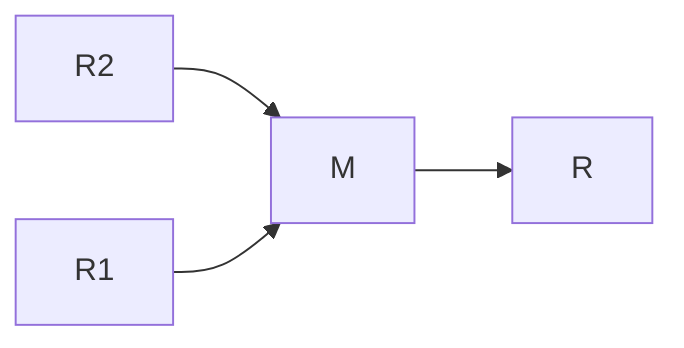
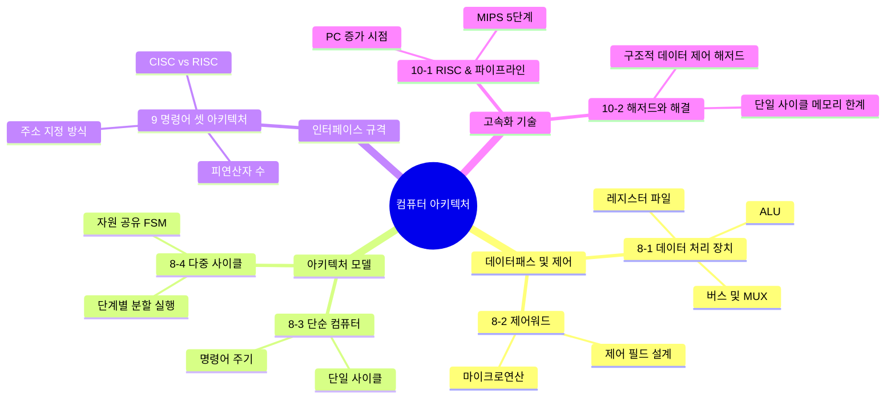
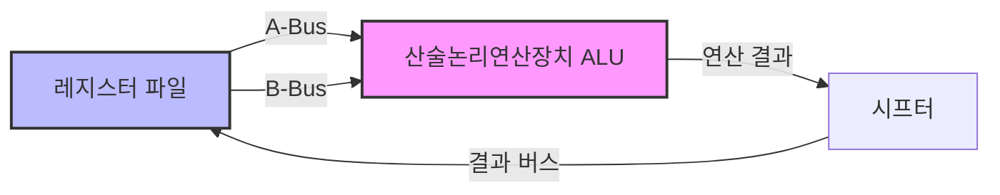
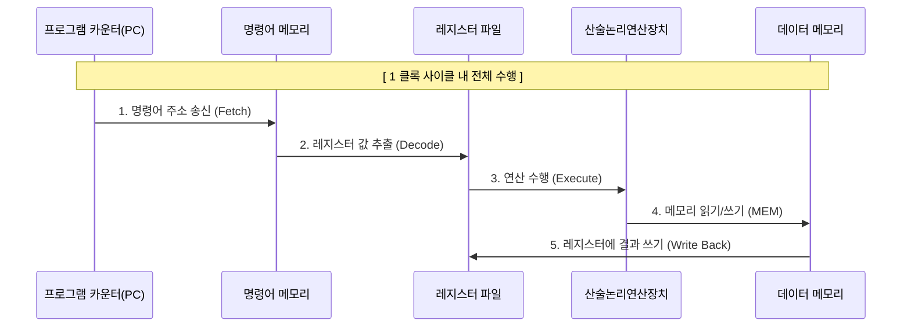
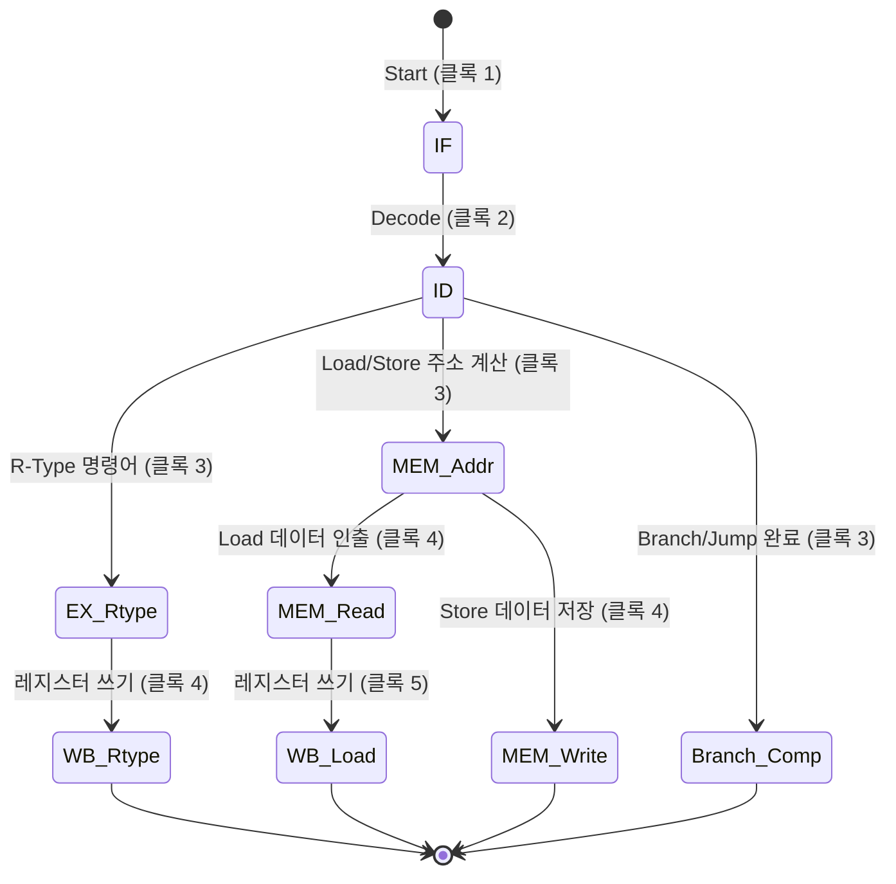
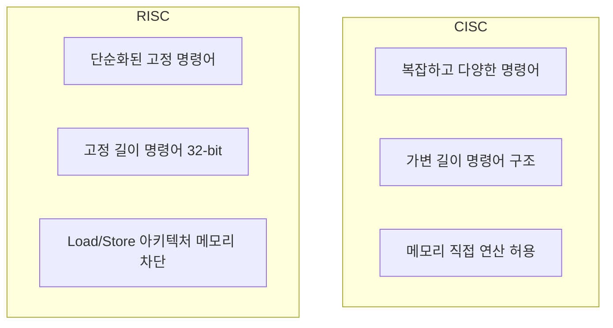
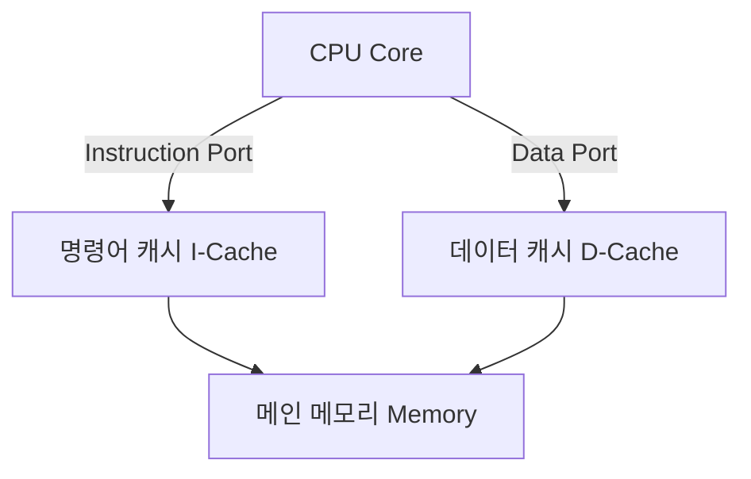

> [!note]+ ### 기본 개념
> > [!note]+ 논리설계 정리
> > > [!note]+ 논리 게이트
> > > AND
> > > 
> > > OR
> > > 
> > > NOT
> > > 
> > > NAND
> > > 
> > > NOR
> > > 
> > > XOR
> > > 
> > > XNOR
> > 
> > - bool 수식 ↔ 논리회로도
> > 
> > 동기식 회로
> > 
> > gate delay(tG)
> > 
> > bcd-to-7-segment converter
> > 
> > decoder
> > 
> > - 2-to-4
> > - 3-to-8
> > 
> > encoder
> > 
> > MUX
> > 
> > - 2-to-1 line MUX
> > 
> > FA
> > 
> > 2진 가산-감산기
> > 
> > - 2의 보수 이용
> > 
> > 조합 회로 / 순차 회로
> > 
> > latch
> > 
> > - feedback
> > - Level trigger
> > - 비동기적
> > - R(0)S(1) latch
> > 
> > flip-flop
> > 
> > - 한 번의 clock 주기에 한 번의 상태 변화만 허용 / Edge trigger
> > - 동기적
> > - master latch
> > - slave latch
> > 
> > Direct inputs
> > 
> > - 강제 입력
> 
> > [!note]+ CPU
> 
> 
> - ==레지스터==
>     - flip-flop
>         - 특성— <u>feedback</u>
>             - 결과 → 입력
>             - <u>이전의 상태 유지 (비휘발성)</u>
>         - 방식
>             - 비동기식 (Latch)
>                 - (Enable 활성화 시 혹은 그냥) 데이터 저장
>                 - RS (EN) Latch
>                 - D  (EN) Latch
>             - <u>동기식</u>
>                 - Clock의 상태 변화 시에만 → <u>데이터 저장</u>
>                 - 상승(Positive) 에지 트리거
>                 - 하강(Negative) 에지 트리거
> - ex
> > [!note]+ bit-register
> > ![[image 179.png]]
> - FA
> - 새로운 회로에 대해, 논리표 —회로의 흐름 이해

### 레지스터

- FF의 구조(Latch + Latch) 정리
    - 마스터 Latch: D, C—(D Latch)—>Q, !Q
        - C—0—입력 값 받아들여 저장(대기)
        - C—1—이전 값 유지
    - 슬레이브 Latch: D, C—(SR Latch)—>Q, !Q
        - C—0—이전 값 유지
        - C—1—마스터의 입력값 그대로 출력
- Load —> Enable
    - with Clock
        - 주기적인 Clock 신호에서 —> 값을 바꾸고 싶을 때에만 Load를 활성화
    - Gate Delay(Clock Gating)
        - 때문에 주기적인 클럭 신호가 게이트들을 통과하게 되면 신호가 늦게 전달된다.
    - 병렬 로드 레지스터
![[image 180.png]]
        - 게이트 없이 바로 연결
            - C(Clock)—> 주기적인 상승-하강 신호 입력
            - EN(Load)—> Clock 신호를 받아들일지 말지 여부 결정

- 디지털 시스템 이해
![[image 181.png]]
    - 데이터 제어(Control Unit) 모듈
        - 데이터 처리 신호 전달
        - (ex: Shift, Count. Clear, Load)
    - 데이터 처리(Datapath) 모듈
        - Micro Operation: 레지스터에 저장된 데이터에 대한 기본동작(한 클럭 동안)
![[image 182.png]]
- 레지스터 전송(RTO)
    - 주소 표기
![[image 183.png]]
        - 내림차순, 괄호로 비트 주소 범위 설정
- Micro Operation의 RTL 표기
    1. Transfer
> [!tip] 💡
> $K1:(R1←R2)$
    2. Arithmetic
![[image 184.png]]
    3. Logic
![[image 185.png]]
    - Shift
![[image 186.png]]
> [!tip] 💡
> 
> - sl(sr)
>     - <<0(0>>)
> - rol(ror)
>     - <<순환(순환>>)
> - asl(asr)
>     - <<부호(부호>>)

> [!note]+ 레지스터 종류
> - PC; 프로그램 카운터
>     - <u>다음</u> <u>명령어의 주소</u> 저장
>     - 명령어 실행 시마다 <u>증가++</u>
> - IR; 명령 레지스터
>     - <u>현재</u> 실행 중인 <u>명령어 저장</u>
> - MAR; 메모리 주소 레지스터
>     - 데이터의 주소 저장(메모리 ↔ CPU)
> - MBR; 메모리 버퍼 레지스터
>     - 데이터 임시 저장(메모리 ↔ CPU)
> - R; 범용 레지스터
> - FR; 플래그 레지스터
> - BR; 베이스 레지스터

- shift
    - ror, rol: 오른쪽끝>>, <<왼쪽끝
    - asr, asl: 입력←부호 (=/2)

- mux-based register
![[image 187.png]]

> clock pulse(제어 신호)에 따라 정해진 순서대로 상태값이 변하는 레지스터

- 종류
    - 직렬
![[image 188.png]]
    - 병렬
![[image 189.png]]
![[image 190.png]]
![[image 191.png]]
- 분류
    - 리플 카운터(Ripple Counter)(=비동기 카운터)
        - 특징
            - Clock 에 대해, 모든 FF이 동시에 동작하지 않음
            - 상승 카운트 <— Down 트리거
            - 하강 카운트 <— Up 트리거
            - 장/단점: 단순(저전력), 내부 지연 —> 속도가 떨어짐
    - 동기 카운터(Synchronous Counter)
        - 특징
            - 동일한 Clock 펄스가 모든 FF를 trigger
(레지스터 선택 시에도)
        - 분류
            - Serial Gating
            - Parallel Gating
        - Syncronous BCD Counter = v
        - BCD Counter
        - 임의 순서 Counter
- 증/감 선택신호 S(1/0) 추가

---

- 개념
- 조합 회로 + FF
- 한 비트 저장하는 순차 회로 설계

---

삼 상태 버퍼

- IN+EN
- 양방향 선로를 가진 3상태 버스

---

- 특징
    - 휘발성 메모리; 전원이 있으면 정보 유지
- Write 절차(CPU—>RAM에 데이터 전달)
    1. 주소 라인 전달<—메모리 주소; MAR
    2. 데이터 라인 전달<—메모리 버퍼; MBR
    3. 쓰기 활성화(EN)
- Read 절차
    1. 주소 전달<—메모리 주소; MAR
    2. 읽기 활성화(EN)
- 주소에 데이터 전달 과정 이해
- 타이밍 신호 파형
    - 클럭 동기화
        - 주소 전달 시간 < 데이터 전달 시간
        - CPU 속도 > RAM 속도
        - 시간에 맞춘 파형(신호) 전송
        - 올바른 주소에 데이터 전달하도록 하기

> [!note]+ 참고: 메모리의 종류 등
> ![[image 192.png]]
> 
> ![[image 193.png]]

- 분류
    - SRAM — 전원 지속 — (cache)
        - 속도 up
        - 직교형 선택 방식
            - 문제 해결
                - data 多 decoder 비용 up
            - 방식
                - 16(4 to 16 Decoder) —> 4 x4(2 to 4 Decoder x 2)
    - DRAM — 전원 주기적으로 방전됨
        - 축전기(C), 트랜지스터(T)
            - 축전기를 사용하여 전하 충전(전압 변화(델타)
            - 주기적인 충전 필요
            - 단순함, 고밀도, 전력소모/속도 낮음
            - 과정
            - select
                - data 0/1 —> capacitor 0/1
> [!note]+ 자료
> ![[c5fd5af8-2054-4f46-9de8-f6885c7dacc4.png]]
> 
> ![[image 194.png]]
        - DRAM 컨트롤러
> [!note]+ SDRAM; sync dram
> - ddr(Double Data Rate) SRAM
>     - bank 를 이용한 속도 개선
>     - DDR2 = bank*ㅇ2^2
- non-programmable system
- programmable system
    - 입력 신호 + 데이터 처리장치 상태
    - 순서 회로 —> 다음 제어신호 발생
![[image 195.png]]
    - 레지스터 연산 시, 데이터 처리 + 데이터 제어 과정 이해
    - 입력(D)과 제어 신호
![[image 196.png]]
> 1En—2DA—3AA—4BA—5MB—6MF—7MD—8G—9H

        1. En: 1
        2. DA(Destination): 11=R3
        3. AA(11=R3)
        4. BA(10=R2)
        5. MB: 0 —> MUX B의 출력 선택
            1. ALU: A(기본값)
            2. Shifter: B(선택)
        6. MF: 0 —> ALU 의 출력값 선택(ALU/Shifter)
        7. MD: 0 —> MUX F의 출력값 선택(MUX F, D)
> [!note]+ 예시
> ![[image 197.png]]
1. 구조
    1. 입/출력
        1. 데이터 입력(D)
        2. 제어 신호 입력(~~)
        3. 데이터 출력(Address, Data)
    2. 연산 회로(ALU)
        4. 산술 연산 회로
        5. 논리 연산 회로
    3. 조합 회로(Shifter)
- 이해
![[image 198.png]]

### 단순 컴퓨터 아키텍처

> [!note]+ 설명
> 단순 컴퓨터 아키텍처(Simple Computer Architecture)는 복잡한 실제 컴퓨터 시스템의 동작 원리를 명확하게 이해하기 위해 설계된 교육용 모델입니다. 이 시스템의 주요 사용 목적은 다음과 같습니다.
> 
> ---
> 
> ## 1. 프로그램 가능 시스템(Programmable System)의 이해
> 
> 가장 핵심적인 목적은 **소프트웨어(명령어)가 어떻게 하드웨어를 제어하는지** 그 과정을 보여주는 것입니다.
> 
> - **유연성 실현:** 비프로그램 시스템처럼 회로를 매번 바꾸는 것이 아니라, 메모리에 저장된 명령어(Instruction)만 교체하여 다양한 작업을 수행하는 원리를 학습합니다.
> - **명령어 해석:** 제어 장치가 메모리에서 명령어를 읽어와 이를 분석하고, 데이터 처리 장치(Datapath)를 움직이는 '제어 워드'로 변환하는 메커니즘을 파악합니다.
> 
> ## 2. 하드웨어 구성 요소 간의 상호작용 학습
> 
> 컴퓨터의 3대 핵심 요소가 어떻게 유기적으로 맞물려 돌아가는지 시각화합니다.
> 
> - **데이터 처리 장치(Datapath):** 실제 연산이 일어나는 통로입니다.
> - **제어 장치(Control Unit):** 연산의 순서와 종류를 결정하는 지휘관 역할을 합니다.
> - **메모리(Memory):** 프로그램(명령어 집합)과 데이터를 저장하는 창고 역할을 합니다.
> 
> ## 3. 마이크로 연산(Micro-operation)의 구체화
> 
> 사용자가 작성한 한 줄의 명령어가 하드웨어 수준에서 어떤 세부적인 단계로 쪼개지는지 확인합니다.
> 
> - 예를 들어, "두 수를 더하라"는 명령어가 레지스터에서 값을 읽고, ALU를 거쳐, 다시 레지스터에 저장되는 시점(Timing)과 **신호 흐름**을 추적할 수 있습니다.
> 
> ## 4. 제어 로직 설계 능력 배양
> 
> 상태도(State Diagram)나 ASM(Algorithmic State Machine) 차트를 통해 제어 장치를 직접 설계해 봄으로써, 논리 회로가 어떻게 지능적인 판단을 내리는지 이해하는 기초가 됩니다.
> 
> ---
> 
> ### **정리하자면**
> 
> 단순 컴퓨터 아키텍처는 "메모리에 저장된 명령어를 하드웨어가 어떻게 순차적으로 실행하여 결과를 내는가?"라는 컴퓨터 공학의 근본적인 질문에 답하기 위한 표준 모델입니다.

- 목적
    - 실제 컴퓨터 시스템의 동작 원리 이해
    - programmable system
- 처리 장치
- 제어 장치
> [!note]+ 제어 워드(Control Word)
> 다중 사이클 컴퓨터의 **제어 워드(Control Word)** 구조에 포함된 각 필드의 명칭과 세부 기능은 다음과 같습니다. 제어 워드는 크게 제어 흐름을 결정하는 **순차 제어(Sequencing)** 영역과 연산을 수행하는 **데이터패스 제어(Datapath)** 영역으로 나뉩니다.
> 
> ---
> 
> ## 1. 순차 제어 (Sequencing) 필드
> 
> 명령어 실행 단계(상태)를 제어하고 다음 수행할 동작을 결정하는 필드입니다.
> 
> - **NS (Next State - 4bit):** **다음 상태**
>     - 제어 상태 레지스터(Control State Register)가 다음에 가리킬 상태 번호를 지정합니다.
> - **PS (PC Selection - 2bit):** **PC 기능 선택**
>     - 프로그램 카운터(PC)의 동작 방식을 결정합니다.
>     - *예: 00 = Hold PC (유지), 01 = Inc PC (1 증가), 10 = Branch (분기), 11 = Jump (점프)*
> - **IL (Instruction Register Load - 1bit):** **IR 로드 여부**
>     - 메모리에서 읽어온 명령어를 명령어 레지스터(IR)에 저장할지 여부를 제어합니다.
>     - *1 = Load instruction (저장), 0 = No load (유지)*
> 
> ---
> 
> ## 2. 데이터패스 제어 (Datapath) 필드
> 
> 레지스터, ALU, 메모리 사이의 데이터 흐름과 연산을 제어하는 필드입니다.
> 
> ### 레지스터 주소 지정 논리
> 
> - **DX (Destination Register eXtension - 4bit):** 목적지 레지스터 확장/지정 필드
> - **AX (Source Register A eXtension - 4bit):** 소스 레지스터 A 확장/지정 필드
> - **BX (Source Register B eXtension - 4bit):** 소스 레지스터 B 확장/지정 필드
> > **참고:** 명령어(IR)에 포함된 레지스터 번호(DR, SA, SB)를 그대로 쓸지, 아니면 제어 워드에 있는 이 필드값(DX, AX, BX)을 직접 쓸지 결정하는 레지스터 주소 로직(Register Address Logic)에 입력됩니다.
> 
> ### 데이터 흐름 및 연산 제어
> 
> - **MB (MUX B Select - 1bit):** **멀티플렉서 B 선택**
>     - ALU의 두 번째 입력(Bus B)으로 레지스터 파일의 출력값을 사용할지(0), 혹은 상수/즉시값(Constant/Immediate)을 사용할지(1) 선택합니다.
> - **FS (Function Select - 4bit):** **기능 선택**
>     - ALU 및 시프터(Function Unit)가 수행할 구체적인 연산 종류(덧셈, 뺄셈, AND, OR, 시프트 등)를 지정하는 연산 코드입니다.
> - **MD (MUX D Select - 1bit):** **멀티플렉서 D 선택**
>     - 레지스터 파일에 최종적으로 저장할(Write back) 데이터로 ALU의 연산 결과(0)를 고를지, 메모리에서 읽어온 데이터(1)를 고를지 선택합니다.
> - **RW (Register Write - 1bit):** **레지스터 쓰기 활성화**
>     - 연산 결과를 레지스터 파일에 저장하도록 허용(1)하거나 금지(0)합니다.
> - **MM (Memory Read / Memory MUX - 1bit):** **메모리 읽기 제어**
>     - 메모리로부터 데이터를 읽는 동작을 활성화하거나 주소 버스 입력을 제어합니다.
> - **MW (Memory Write - 1bit):** **메모리 쓰기 활성화**
>     - 메모리의 특정 주소에 데이터를 저장(쓰기)하도록 허용(1)하거나 금지(0)합니다.

> [!note]+ Fetch, Decode, Excution
> 다중 사이클 컴퓨터에서 명령어가 실행되는 3가지 중심 단계(**Fetch, Decode, Execute**) 동안, 앞서 살펴본 제어 워드(Control Word)의 필드들이 어떻게 작동하는지 핵심만 정리해 드립니다.
> 
> ---
> 
> ### 1. Fetch (명령어 인출 단계)
> 
> PC(프로그램 카운터)가 가리키는 주소에서 명령어를 가져와 **IR(명령어 레지스터)에 저장**하고, 다음 명령어를 위해 **PC를 증가**시키는 단계입니다.
> 
> - **IL = 1:** 메모리에서 읽어온 명령어를 IR에 정상적으로 저장(Load)합니다.
> - **PS = 01 (Inc PC):** 다음 명령 주소를 가리키도록 PC 값을 1 증가시킵니다.
> - **MM = 1:** 메모리 읽기 동작을 활성화하여 명령어를 버스로 가져옵니다.
> 
> ---
> 
> ### 2. Decode (명령어 해독 단계)
> 
> IR에 로드된 명령어의 **OP code(연산 코드)를 해석**하여 다음 이동할 상태(`NS`)를 결정하고, 연산에 필요한 레지스터 주소를 파악하는 단계입니다.
> 
> - **IL = 0:** 인출된 명령어가 바뀌지 않도록 IR 로드를 비활성화(No load)합니다.
> - **PS = 00 (Hold PC):** 명령어 실행 주소가 확정될 때까지 현재 PC 값을 그대로 유지합니다.
> - **Register Address Logic 활성화:** IR의 `SA`, `SB` 필드나 제어 워드의 `AX`, `BX` 필드를 통해 연산에 사용할 소스 레지스터를 선택하고 데이터를 읽어옵니다.
> 
> ---
> 
> ### 3. Execute (명령어 실행 단계)
> 
> 해독된 명령어의 종류에 따라 ALU 연산을 수행하거나 메모리에 접근하는 단계입니다. **명령어 종류에 따라 제어 워드 값이 완전히 달라집니다.**
> 
> - **산술/논리 연산 명령어 (예: ADD, SUB)**
>     - **FS:** 수행할 연산(예: 덧셈)을 지정합니다.
>     - **MB = 0:** ALU의 두 번째 입력으로 레지스터(Bus B) 값을 사용합니다.
>     - **MD = 0:** ALU 연산 결과를 선택하여 레지스터로 보냅니다.
>     - **RW = 1:** 최종 계산 값을 목적지 레지스터(DR)에 저장합니다.
> - **메모리 로드 명령어 (LD)**
>     - **MM = 1:** 데이터 메모리 읽기를 활성화합니다.
>     - **MD = 1:** ALU 결과가 아닌, 메모리에서 읽어온 데이터를 선택합니다.
>     - **RW = 1:** 읽어온 데이터를 레지스터에 저장합니다.
> - **메모리 저장 명령어 (ST)**
>     - **MW = 1:** 데이터 메모리 쓰기를 활성화하여 레지스터의 데이터를 메모리에 기록합니다.

### 다중 사이클 컴퓨터

| **구분**        | **단일 사이클 컴퓨터**       | **다중 사이클 컴퓨터**                          |
| ------------- | -------------------- | --------------------------------------- |
| **명령어당 클럭 수** | 무조건 1 Clock          | 명령어의 복잡도에 따라 다름 (n Clock)               |
| **클럭 주기 길이**  | **김** (가장 느린 명령어 기준) | **짧음** (각 실행 단계별 지연 시간 기준)              |
| **메모리 구성**    | 명령어 / 데이터 메모리 **분리** | 하나의 **통합 메모리** 사용                       |
| **제어장치 구조**   | 조합 제어 회로             | 순차 제어 회로 (제어 상태 + 조합 회로)                |
| **주요 추가 부품**  | 비교적 단순함              | **IR**(명령어 레지스터), 임시 레지스터, 확장된 PC 제어 논리 |

### instruction set architecture

2. A암시 모드(implied mode)
3. `#즉치` 모드(Immediate mode)
4. R레지스터 모드(Register mode)
    1. ()간접 모드(Register-indirect)
        1. ()+-자동 증가/감소
    2. 직접 모드(Regisert-direct) — 직접 주소 전
- 명령어가 실행될 때마다 증가
    - 워드의 수 많음

- procedure call/return
- 

---

### 문제

- [ ] 시프트 레지스터 + 순환
    - (shift, Load), SI(L/R), D*(2^n), Clk, S(2) —> Q*(2^n)
- [ ] 3 상태 레지스터
- [ ] <u>EN </u>+ L + D
- [ ] EN + L + MUX
> [!note]+ n 비트 선택 과정 일반화
> ![[4.png]]
- [ ] Clock - time 파형
- [ ] Dram 충전, 과정
- [ ] 동작 분석, RTO 표기

[[컴퓨터구조#세부 파일: 02-3 멀티플렉서 - 컴퓨터구조|02-3 멀티플렉서 - 컴퓨터구조]]

[[컴퓨터구조#세부 파일: 확장 레지스터 — RAM|확장 레지스터 — RAM]]

[[컴퓨터구조#세부 파일: RAM 동작 과정|RAM 동작 과정]]

---
## 세부 파일: 02-3 멀티플렉서 - 컴퓨터구조

[https://wikidocs.net/311882](https://wikidocs.net/311882)

#### 1. 멀티플렉서 (Multiplexer, MUX) 개요

**멀티플렉서**는 여러 개의 **데이터 입력 라인** 중 **하나**를 선택하여 단일 **출력 라인**으로 연결하는 조합 회로이다. 데이터 선택 스위치 역할을 한다.

- **선택 입력 ():** 어떤 데이터 입력을 선택할지 결정하는 제어 신호이다.
- **관계식:** 개의 선택 입력은 개의 데이터 입력을 제어할 수 있다.

#### 2. 4x1 멀티플렉서 (4x1 MUX)

4x1 MUX는 4개의 데이터 입력( ~ )과 2개의 선택 입력()을 가진다.

#### 2.1. 4x1 MUX의 함수표

4x1 멀티플렉서는 2개의 선택 입력()을 사용하여 4개의 데이터 입력( ~ ) 중 하나를 출력 로 내보낸다.

| 선택 입력 (Selection Inputs) |   | 출력 (Output) |
| --- | --- | --- |
| **S1** | **S0** | **Y (선택된 데이터)** |
| 0 | 0 | I0 |
| 0 | 1 | I1 |
| 1 | 0 | I2 |
| 1 | 1 | I3 |

#### 2.2. 4x1 MUX의 논리식

#### 2.3. 4x1 MUX의 논리도

4x1 MUX는  게이트,  게이트,  게이트로 구성된다.

#### 3. Quadruple 2x1 멀티플렉서

**Quadruple 2x1 MUX**는 2x1 MUX 4개가 하나의 칩에 통합된 형태로, **4비트** 데이터 쌍 중 하나를 선택하는 데 사용된다. 모든 2x1 MUX는 **하나의 공통 선택 입력** 에 의해 제어된다.

#### 3.1. Quadruple 2x1 MUX의 블록 다이어그램

- **입력:** 두 개의 4비트 데이터 버스 (와 )를 가진다.

#### 3.2. Quadruple 2x1 MUX의 함수표

| 공통 선택 입력 | 4비트 출력 | 설명 |
| --- | --- | --- |
| **S** | **Y3Y2Y1Y0** |   |
| 0 | A3A2A1A0 | 데이터 버스 A 선택 |
| 1 | B3B2B1B0 | 데이터 버스 B 선택 |

이러한 MUX는 4비트 레지스터 간 데이터 교환이나 버스 소스 선택에 유용하게 사용된다.

---
## 세부 파일: RAM 동작 과정


![[image 214.png]]

![[image 215.png]]

![[image 216.png]]

![[image 217.png]]

![[image 218.png]]

![[image 219.png]]

![[image 220.png]]

![[image 221.png]]

---
## 세부 파일: 확장 레지스터 — RAM


- 목적: <u>데이터 저장*(Write)*</u>
- latch
    1. <u>SR LATCH</u>: AND, OR
![[image 199.png]]
![[image 200.png]]
![[image 201.png]]
    2. <u>Gated Latch(D Latch)</u>: Write Enable, D —> [레지스터](/348f9f43a08580feacc3d1198d2114cb#348f9f43a08580c3a323d4db93de84f3)
![[image 202.png]]
![[image 203.png]]
![[image 204.png]]
- 레지스터
    1. <u>8-bit Register</u>: Write Enable(1), <u>Data(8)</u>
![[image 205.png]]
    2. 16x16(256) Latch Matrix —> [256-bit Memory](/348f9f43a08580feacc3d1198d2114cb#348f9f43a085805c99cece5dad2f5428)
![[image 206.png]]
        - 필요한 선: <u>35</u>
            - <u>Selection(16+16)</u>, W Enable(1), R Enable(1), <u>Data(1)</u>
        - 주소 지정 방식 개선
            - 목적: 16+16 Selection —> <u>4+4 bit Address</u>
![[image 207.png]]
            - 사용: <u>Multiplexer(1 X 16</u>)
![[image 208.png]]
            - 결과: **256-bit Memory**
                - 필요한 선: <u>**11**</u>
                    - <u>**Adress(4+4)**</u>, W Enable(1), R Enable(1), Data(1)
![[image 209.png]]

RAM

1. <u>**256-byte**</u> Memory
![[image 210.png]]
    - Input: <u>**Adress(8)**</u>, W Enable(1), R Enable(1), <u>**Data(8)**</u>
![[image 211.png]]
![[image 212.png]]
![[image 213.png]]


---
## 세부 파일: 컴퓨터구조(기말)

[[컴퓨터구조#세부 파일: 학습_목차|학습_목차]]

[[컴퓨터구조#세부 파일: 학습_노트|학습_노트]]


---
## 세부 파일: 학습_노트

## 📚 논리설계 / 컴퓨터구조 핵심 학습 노트

이 문서는 **‘논리설계 및 컴퓨터 아키텍처’** 과목의 핵심 단원들을 체계적으로 학습하기 위해 작성된 개념 노트입니다. 각 단원의 핵심 의의, 동작 예제, 그리고 표와 다이어그램(마인드맵)을 활용하여 직관적인 이해를 돕도록 구성되었습니다.

---

### 📂 전체 학습 구조 마인드맵



---

### 📌 [8-1] 데이터 처리 장치 (Datapath / Data Processing Unit)

#### 💡 학습 의의

데이터 처리 장치(Datapath)는 컴퓨터가 산술 및 논리 연산을 처리하는 **‘근육’**에 해당합니다. CPU 내에서 데이터가 레지스터에서 인출되어 ALU를 거쳐 다시 레지스터로 돌아오는 경로를 설계하고 분석하는 능력이 핵심입니다.

#### 1. 데이터패스 구성요소 간의 유기적 관계

- **레지스터 파일(Register File):** 피연산자를 임시 저장하며 다수의 레지스터로 구성됨.
- **ALU (Arithmetic Logic Unit):** 실제 덧셈, 뺄셈, AND, OR, Shift 등의 연산을 수행.
- **버스(Bus) 및 MUX:** 데이터를 여러 하드웨어 컴포넌트로 전달하기 위한 통로이자 선택기.



---

### 📌 [8-2] 제어워드 (Control Word)

#### 💡 학습 의의

제어워드(Control Word)는 데이터 패스에 있는 MUX, ALU, 레지스터 등의 부품들에게 **“동시에 어떤 동작을 해야 하는지”** 지시하는 이진 비트 열입니다. 하드웨어가 일사불란하게 움직이도록 지휘하는 악보와 같습니다.

#### 1. 14비트 제어워드(Control Word) 구성 예시

각 필드는 데이터패스의 특정 제어 신호에 매핑됩니다.

| 필드 | DA (Destination) | AA (A-Source) | BA (B-Source) | FS (Func Select) | MD (MUX Data) | RW (Reg Write) |
| --- | --- | --- | --- | --- | --- | --- |
| **비트수** | 3비트 | 3비트 | 3비트 | 4비트 | 1비트 | 1비트 |
| **역할** | 결과 저장 레지스터 | 첫 번째 피연산자 | 두 번째 피연산자 | ALU 연산 종류 | 레지스터 입력 선택 | 쓰기 허용 여부 |

#### 2. 마이크로연산 예제: $R1 \leftarrow R2 + R3$

레지스터 $R2$와 $R3$의 값을 더해 $R1$에 저장하는 마이크로연산의 제어 신호를 인코딩하는 과정입니다.

- **AA (A-Source):** $R2$ 레지스터 선택 $\rightarrow$ `010`
- **BA (B-Source):** $R3$ 레지스터 선택 $\rightarrow$ `011`
- **DA (Destination):** $R1$ 레지스터 선택 $\rightarrow$ `001`
- **FS (ALU Operation):** ADD(덧셈) 연산 선택 $\rightarrow$ `0010`
- **MD (MUX Data Select):** ALU 출력 데이터 선택 $\rightarrow$ `0`
- **RW (Register Write):** 결과 저장을 위한 쓰기 활성화 $\rightarrow$ `1`

$$
\text{완성된 제어워드} = \mathbf{001\ 010\ 011\ 0010\ 0\ 1}
$$

---

### 📌 [8-3] 단순 컴퓨터 아키텍처 (Simple Computer Architecture)

#### 💡 학습 의의

하나의 클록 주기(Clock Cycle) 내에 하나의 명령어를 인출(Fetch), 해독(Decode), 실행(Execute)하는 **단일 사이클 컴퓨터(Single-Cycle Computer)**의 아키텍처를 배웁니다. 복잡한 시스템으로 나아가기 위한 가장 직관적인 기초 모델입니다.



#### ⚠️ 단일 사이클 아키텍처의 치명적 한계: Critical Path

- **원인:** 클록 주기는 **가장 오래 걸리는 명령어(예: Load)**의 전파 지연 시간에 맞춰 설정되어야 합니다.
- **결과:** 가벼운 명령어(예: `ADD`)를 수행할 때도 가장 느린 메모리 접근 시간만큼을 똑같이 기다려야 하므로, CPU의 자원이 크게 낭비됩니다.

---

### 📌 [8-4] 다중 사이클 컴퓨터 (Multi-cycle Computer)

#### 💡 학습 의의

단일 사이클 컴퓨터의 한계를 극복하기 위해, **명령어를 여러 클록 사이클에 걸쳐 실행하도록 분할한 아키텍처**입니다. 각 명령어의 특징에 맞춰 필요한 단계 수만큼만 클록을 소모하도록 설계합니다.

#### 1. 명령어 실행 단계 (State) 전이도



#### 2. 단일 사이클 vs 다중 사이클 핵심 요약

- **자원 공유(Resource Sharing):** 다중 사이클에서는 단계가 클록으로 분리되어 자원을 재사용할 수 있습니다. 단일 사이클처럼 명령어 메모리와 데이터 메모리를 분리할 필요 없이 하나의 **통합 메모리(Unified Memory)**만 사용해도 충돌이 일어나지 않습니다.
- **제어 유닛의 복잡도:** 조합 회로(단일 사이클)에서 FSM(유한상태머신, 다중 사이클) 구조로 제어장치가 복잡해집니다.

---

### 📌 [9] 명령어 셋 아키텍처 (Instruction Set Architecture - ISA)

#### 💡 학습 의의

ISA는 **소프트웨어(컴파일러/어셈블러)와 하드웨어(CPU) 간의 계약서**입니다. 하드웨어가 제공하는 명령어 집합과 레지스터, 메모리 접근 방법을 규정합니다.

#### 1. 피연산자(Operand) 수에 따른 아키텍처 분류

연산 `Y = (A + B) * C`를 구현하는 방식의 차이:

| 아키텍처 구분 | 명령어 수 | 특징 및 예시 어셈블리 |
| --- | --- | --- |
| **3-주소 방식** (Register-Register) | 적음 | `ADD R1, A, B`  `MUL Y, R1, C` |
| **2-주소 방식** | 보통 | `MOV R1, A`  `ADD R1, B`  `MUL R1, C`  `MOV Y, R1` |
| **1-주소 방식** (Accumulator) | 많음 | `LOAD A` (AC에 로드)  `ADD B` (AC = AC + B)  `MUL C` (AC = AC * C)  `STORE Y` |
| **0-주소 방식** (Stack) | 아주 많음 | `PUSH A`  `PUSH B`  `ADD` (Pop 2개 후 더해서 Push)  `PUSH C`  `MUL`  `POP Y` |

#### 2. CISC와 RISC 아키텍처 비교



---

### 📌 [10-1] RISC, 파이프라인 (RISC, Pipeline)

#### 💡 학습 의의

파이프라이닝은 공장의 컨베이어 벨트처럼 **여러 명령어의 실행 단계를 겹쳐서 수행함으로써 성능(Throughput)을 극대화하는 기법**입니다.

#### 1. MIPS 5단계 파이프라인 중첩 흐름

| 클록 사이클 | CC 1 | CC 2 | CC 3 | CC 4 | CC 5 | CC 6 | CC 7 |
| --- | --- | --- | --- | --- | --- | --- | --- |
| **명령어 1** | **IF** | **ID** | **EX** | **MEM** | **WB** |   |   |
| **명령어 2** |   | **IF** | **ID** | **EX** | **MEM** | **WB** |   |
| **명령어 3** |   |   | **IF** | **ID** | **EX** | **MEM** | **WB** |

#### 2. PC(프로그램 카운터) 증가 시점 (PC Increment Timing) 🔍

파이프라인 아키텍처에서 PC 값이 증가하는 물리적인 시점은 매우 중요합니다.

- **증가 타이밍:** PC는 **명령어 인출(IF) 단계의 극초반**에 클록 에지를 기준으로 즉시 $PC + 4$**(명령어가 4바이트인 경우)**로 증가합니다.
- **이유:** 다음 클록 사이클에 지체 없이 바로 다음 명령어를 인출해야 하기 때문입니다. 즉, 현재 명령어의 해독(ID)이 채 끝나기도 전에 다음 명령어의 주소는 이미 결정되어 있어야 합니다.
- **분기(Branch) 발생 시:** $PC+4$로 미리 증가되어 있었던 PC 값은 분기 명령어의 실행 단계($EX$ 혹은 $MEM$)에서 분기 주소가 참으로 계산될 경우, 새로운 타겟 주소로 덮어쓰여집니다.

---

### 📌 [10-2] 파이프라인의 문제 및 해결 (Pipeline Hazards & Solutions)

#### 💡 학습 의의

파이프라이닝은 병렬 실행 도중 자원, 데이터, 혹은 흐름의 충돌이 발생하는 **해저드(Hazard)** 문제를 필연적으로 겪게 됩니다. 이를 하드웨어와 컴파일러 차원에서 극복하는 고도의 설계 기술을 이해해야 합니다.

#### 1. 단일 사이클 메모리의 문제 (Single-cycle Memory issue in Pipeline) 🔍

- **문제 상황:** 파이프라인에서는 `명령어 1`이 메모리에서 데이터를 읽거나 쓰는 **MEM 단계**에 있을 때, `명령어 4`는 동시에 메모리에서 명령어를 가져오는 **IF 단계**에 진입하게 됩니다. 만약 하나의 공통 메모리(단일 사이클 메모리)만 존재한다면 **자원 충돌(구조적 해저드)**이 일어납니다.
- **해결책 (하버드 아키텍처):** 물리적인 메모리 버스를 **명령어 캐시(I-Cache)**와 **데이터 캐시(D-Cache)**로 완벽하게 이원화하여 분리함으로써 두 단계가 충돌 없이 작동하도록 설계합니다.



#### 2. 해저드의 3대 유형 및 해결 방법 정리

#### ① 구조적 해저드 (Structural Hazard)

- **원인:** 동일한 하드웨어 자원을 두 개 이상의 단계가 동시에 요구할 때.
- **해결:** 자원의 추가 배치(예: 하버드 아키텍처, 레지스터 쓰기/읽기 포트 분리 등).

#### ② 데이터 해저드 (Data Hazard)

- **원인:** 이전 명령어가 레지스터에 연산 결과를 기록하기도 전에, 다음 명령어가 해당 레지스터를 읽어야 하는 경우 (RAW: Read After Write).
- **해결:**
    - **Forwarding (포워딩):** 연산 결과를 레지스터 파일에 쓰기 전에, ALU 출력단에서 다음 명령어의 ALU 입력단으로 직접 데이터를 보내줌(Bypassing).
    - **Stall / Bubble 삽입:** 포워딩으로 해결할 수 없는 경우(예: Load 명령어 바로 다음 연산에 데이터가 필요할 때), 1사이클을 강제로 지연시킴.

```plain text
[데이터 해저드 예시]
ADD R1, R2, R3   ; R1에 결과 저장 (WB 단계에서 완료)
SUB R4, R1, R5   ; R1을 피연산자로 사용 (ID 단계에서 읽으려 함 -> 충돌!)
                 ; Forwarding을 활용하면 ADD의 EX 단계 끝에서 SUB의 EX 단계 시작으로 직접 데이터 주입
```

#### ③ 제어 해저드 (Control Hazard)

- **원인:** 분기(Branch/Jump) 명령어의 결과가 확정되기 전에 다음 명령어들을 먼저 인출하여 발생.
- **해결:**
    - **분기 예측 (Branch Prediction):** 분기가 수행될지 안 될지 예측하여 명령어 인출. 실패 시 파이프라인 내의 잘못 인출된 명령어들 무효화(Flush).
    - **지연 분기 (Delayed Branch):** 분기 명령어 바로 다음 사이클(Delay Slot)에는 분기 여부와 상관없이 무조건 실행 가능한 명령어(NOP 등)를 컴파일러가 채워 넣음.

---
## 세부 파일: 학습_목차

## 🖥️ 논리설계 / 컴퓨터구조 학습 목차 및 상세 하위 주제

이 문서는 **‘논리설계 및 컴퓨터 아키텍처’** 과목의 핵심 단원(데이터 처리 장치, 제어 아키텍처, ISA, RISC 및 파이프라이닝)을 체계적으로 학습하기 위해 구성된 목차 및 상세 하위 주제 목록입니다.

---

### 📌 [8-1] 데이터 처리 장치 (Datapath / Data Processing Unit)

> **핵심 개념:** CPU 내에서 실제 연산과 데이터 이동을 담당하는 하드웨어 경로(Datapath)의 구성원리와 설계

- **1. 데이터 패스(Datapath)의 개요**
    - 데이터 처리 장치의 정의 및 역할
    - 제어 장치(Control Unit)와 데이터 처리 장치의 상호 작용 개요
- **2. 레지스터 파일(Register File) 설계**
    - 레지스터의 개념 및 내부 구조 (D 플립플롭과 디코더/멀티플렉서 조합)
    - 멀티포트 레지스터 파일 (동시 읽기 및 쓰기 동작)
- **3. 버스(Bus) 시스템 및 멀티플렉서(MUX)**
    - 버스 시스템의 필요성 (Point-to-Point 연결 대비 공통 버스의 장점)
    - MUX를 이용한 버스 구성과 3상태 버퍼(Tri-state Buffer)를 이용한 버스 구성 비교
- **4. 산술논리연산장치 (ALU: Arithmetic Logic Unit)**
    - **산술 회로 (Arithmetic Unit):** 반가산기/전가산기를 이용한 이진 가산기, 감산기, 가감산기 및 인크리멘터(Incrementer)
    - **논리 회로 (Logic Unit):** 비트단위(Bitwise) AND, OR, XOR, NOT 연산기 구성
    - **시프트 회로 (Shift Unit):** 논리 시프트(Logical), 산술 시프트(Arithmetic), 순환 시프트(Rotate)

<!-- Column 1 -->
- **5. 데이터 처리 장치의 결합**
    - ALU, 레지스터 파일, 버스, 시프터가 유기적으로 연결된 전체 데이터 패스 다이어그램 분석

<!-- Column 2 -->
### 📌 [8-2] 제어워드 (Control Word)

---

> **핵심 개념:** 데이터 처리 장치의 레지스터 선택, ALU 연산 및 쓰기 동작을 한 번에 제어하기 위해 사용되는 2진 비트 열(Control Word)의 구조와 매핑

- **1. 제어워드(Control Word)의 정의**
    - 제어 신호의 집합으로서의 제어워드 개념
    - 컴퓨터 아키텍처에서 제어워드가 미치는 하드웨어적 영향
- **2. 제어 필드(Control Fields) 분할 및 설계**
    - **DA (Destination Address):** 연산 결과를 저장할 목적지 레지스터 선택 필드
    - **AA (A-Source Address):** 첫 번째 피연산자를 읽을 레지스터 선택 필드
    - **BA (B-Source Address):** 두 번째 피연산자를 읽을 레지스터 선택 필드
    - **FS (Function Select):** ALU 및 시프터가 수행할 연산(Function) 결정 필드 (예: Add, Sub, Shift_Left 등)
    - **MD (MUX Select for Data):** 메모리나 ALU 출력 중 목적지에 쓸 데이터를 선택하는 필드
    - **RW (Register Write Enable):** 레지스터 파일에 값을 쓸 것인지 여부를 결정하는 1비트 필드
- **3. 마이크로연산(Microoperation) 제어 실습**
    - 예시 명령어 (예: $R1 \leftarrow R2 + R3$)를 수행하기 위한 구체적인 제어워드 2진수 값 인코딩/디코딩 과정 분석

---

### 📌 [8-3] 단순 컴퓨터 아키텍처 (Simple Computer Architecture)

> **핵심 개념:** 한 클록 주기에 하나의 명령어를 인출(Fetch)하고 실행(Execute)하는 단일 사이클 컴퓨터의 하드웨어 설계

- **1. 단일 사이클 컴퓨터(Single-Cycle Computer)의 개요**
    - 주요 구성 요소: PC(프로그램 카운터), 명령어 메모리(Instruction Memory), 레지스터 파일, ALU, 데이터 메모리(Data Memory)
    - 단일 클록 주기 내에 모든 연산이 끝나는 동기식 하드웨어 루프
- **2. 명령어 실행 주기 (Instruction Cycle)**
    1. **Instruction Fetch (인출):** PC가 가리키는 메모리 주소에서 명령어를 가져옴
    2. **Instruction Decode (해독):** 기계어 비트를 해독하여 피연산자와 연산 종류 파악
    3. **Execute (실행):** ALU 연산 수행 또는 메모리 접근(Load/Store) 수행
- **3. 제어 장치(Control Unit)의 테이블 설계**
    - 기계어 명령어(R-type, Load, Store, Branch)에 따른 제어 신호 값 생성 규칙 (Truth Table 설계)
    - 조합 회로(Combinational Logic)로 구현되는 제어 장치
- **4. 단일 사이클 컴퓨터의 한계 및 성능 분석**
    - 가장 지연 시간이 긴 명령어(예: 메모리에서 값을 읽어오는 Load 명령어)의 Critical Path에 맞춰 클록 주기가 결정됨
    - 이로 인해 가벼운 연산(예: Add)을 할 때도 동일한 긴 시간을 기다려야 하므로 발생하는 비효율성 이해

---

### 📌 [8-4] 다중 사이클 컴퓨터 (Multi-cycle Computer)

> **핵심 개념:** 단일 사이클의 비효율성을 극복하기 위해, 하나의 명령어를 여러 개의 작은 단계(State)로 나누고 클록 속도를 높인 아키텍처

- **1. 다중 사이클 컴퓨터의 기본 원리**
    - 하나의 명령어를 여러 클록 사이클로 분할하여 실행
    - 클록 주기를 단축하고, 각 명령어 유형에 따라 필요한 만큼의 클록 사이클만 사용
- **2. 단계별 세부 동작 (Execution Phases)**
    - **Step 1 (Instruction Fetch):** IR $\leftarrow$ M[PC], PC $\leftarrow$ PC + 1
    - **Step 2 (Decode & Register Fetch):** 피연산자 레지스터 읽기 및 분기 대상 주소 계산
    - **Step 3 (Execution / Address Calculation):** ALU 연산 또는 메모리 유효 주소 계산
    - **Step 4 (Memory Access / R-type completion):** 메모리 읽기/쓰기 또는 연산 결과를 레지스터에 기록
    - **Step 5 (Write Back):** Load 명령어 완료를 위해 메모리 값을 레지스터에 기록
- **3. 자원 공유(Resource Sharing)와 임시 레지스터**
    - 메모리와 ALU의 재사용: 단일 사이클과 달리 하나의 메모리(Unified Memory)와 하나의 ALU만으로 구성 가능
    - 단계 간 데이터 보존을 위한 임시 레지스터(IR, MDR, A, B, ALUOut)의 필요성
- **4. 제어 유닛(Control Unit) 설계 방식**
    - **하드와이어드 제어 (Hardwired Control):** 상태 천이 다이어그램(State Transition Diagram) 및 FSM(Finite State Machine) 기반 제어 설계
    - **마이크로프로그램 제어 (Microprogrammed Control):** 제어 메모리(Control Memory)에 매크로 명령어의 실행 단계를 제어 단어들(Microinstructions)로 미리 저장해 두는 방식

---

### 📌 [9] 명령어 셋 아키텍처 (Instruction Set Architecture - ISA)

> **핵심 개념:** 프로그래머(혹은 컴파일러)가 바라보는 하드웨어의 인터페이스 규격이자 기계어 명령어의 설계 표준

- **1. ISA의 정의 및 역할**
    - 소프트웨어(컴파일러, OS)와 하드웨어(CPU) 사이의 규격
    - 응용 프로그래머가 접근 가능한 자원(레지스터, 메모리 공간) 정의
- **2. 피연산자 수(Operand Count)에 따른 명령어 설계**
    - **3-주소 명령어 (Three-address instruction):** `ADD R1, R2, R3` (레지스터-레지스터 구조)
    - **2-주소 명령어 (Two-address instruction):** `ADD R1, R2` (피연산자 중 하나가 목적지가 됨)
    - **1-주소 명령어 (One-address instruction):** 누산기(Accumulator) 기반 아키텍처
    - **0-주소 명령어 (Zero-address instruction):** 스택(Stack) 아키텍처 (예: JVM)
- **3. 주소 지정 방식 (Addressing Modes)**
    - **즉치 주소 지정 (Immediate):** 피연산자 자체가 명령어 내의 상수 값인 경우
    - **레지스터 직접 주소 지정 (Register Direct):** 피연산자가 레지스터 내에 있는 경우
    - **직접 주소 지정 (Direct/Absolute):** 피연산자의 메모리 주소가 명령어에 직접 포함된 경우
    - **간접 주소 지정 (Indirect):** 피연산자가 들어있는 메모리 주소의 주소를 가리키는 경우
    - **변위 주소 지정 (Displacement):** 기준 주소에 오프셋을 더해 계산 (PC 상대, 베이스 레지스터, 인덱스 레지스터 주소 지정)
- **4. CISC 아키텍처 vs RISC 아키텍처**
    - **CISC (Complex Instruction Set Computer):** 복잡하고 다양한 형태의 명령어, 가변 길이, 메모리 연산 직접 허용
    - **RISC (Reduced Instruction Set Computer):** 단순하고 균일한 명령어, 고정 길이(예: 32비트), 오직 Load/Store 명령어로만 메모리 접근

---

### 📌 [10-1] RISC, 파이프라인 (RISC, Pipeline)

> **핵심 개념:** RISC 아키텍처의 균일한 구조적 이점을 극대화하여 여러 명령어를 동시에 중첩 실행하는 파이프라이닝 기술 및 PC 업데이트 메커니즘

- **1. 파이프라이닝(Pipelining) 개요**
    - 시분할 방식으로 단계별 자원을 중첩(Overlap)하여 실행 속도와 명령어 처리량(Throughput)을 향상시키는 기법
    - 클록 속도와 CPI(Cycles Per Instruction) 개념의 재정의
- **2. MIPS 5단계 표준 파이프라인**
    1. **IF (Instruction Fetch):** 메모리에서 명령어 인출
    2. **ID (Instruction Decode):** 명령어 해독 및 레지스터 파일 읽기
    3. **EX (Execute):** ALU 연산 수행 또는 주소 계산
    4. **MEM (Memory Access):** 메모리 읽기/쓰기 동작 수행
    5. **WB (Write Back):** 최종 결과를 레지스터 파일에 쓰기
- **3. PC(프로그램 카운터) 증가 시점 (PC Increment Timing) 🔍**
    - **PC 증가 시점 분석:**
        - PC는 **명령어 인출(IF) 단계의 초반부(시작 지점)**에 즉시 $PC + 4$ (또는 $PC + \text{명령어크기}$)로 업데이트됨
        - 이는 현재 인출 중인 명령어가 다 해독되기도 전에, 다음 클록 사이클에서 인출할 명령어가 준비될 수 있도록 보장하기 위함
    - **분기/점프 발생 시의 예외적 PC 업데이트:**
        - 무조건 분기(Jump)나 조건 분기(Branch) 명령어가 실행될 경우, 이미 증가된 PC 값은 파이프라인의 **ID 단계(또는 EX/MEM 단계)**에서 계산된 새로운 타겟 주소(Target Address)로 덮어쓰여짐(Overwrite)
        - 이로 인해 발생할 수 있는 제어 흐름 충돌과 파이프라인의 흐름 변화 이해

---

### 📌 [10-2] 파이프라인의 문제 및 해결 (Pipeline Hazards & Solutions)

> **핵심 개념:** 파이프라인의 병렬 실행 중 발생하는 충돌(Hazard) 현상들과 이를 극복하기 위한 하드웨어/소프트웨어적 해결법

- **1. 단일 사이클 메모리의 문제 (Single-cycle Memory issue in Pipeline) 🔍**
    - **구조적 충돌의 원인:** 파이프라인의 `IF 단계`(명령어 인출)와 `MEM 단계`(Load/Store 데이터 접근)가 동일한 시점에 동일한 하나의 물리적 메모리에 접근하려고 할 때 자원 충돌 발생
    - **해결책 (하버드 아키텍처 및 캐시 분리):**
        - 물리적 메모리를 **명령어 캐시(I-Cache)**와 **데이터 캐시(D-Cache)**로 독립적으로 분리하여 동시에 읽고 쓸 수 있는 구조 설계
- **2. 파이프라인 해저드(Pipeline Hazards)의 분류와 해결**
    - **① 구조적 해저드 (Structural Hazard)**
        - **현상:** 하드웨어 자원이 부족하여 두 개 이상의 명령어가 동일한 하드웨어 자원을 요구할 때 발생
        - **해결:** 자원 추가 설치(예: 메모리 분리) 또는 하드웨어 Stall(지연) 삽입
    - **② 데이터 해저드 (Data Hazard)**
        - **현상:** 어떤 명령어가 이전 명령어의 연산 결과를 참조해야 하는데, 이전 명령어가 아직 레지스터 파일에 결과를 기록하지 않은 시점(WB 이전)에 읽으려고(ID) 할 때 발생 (RAW: Read After Write)
        - **해결 기법:**
            - **Forwarding / Bypassing (전송/우회):** 레지스터에 기록되기 전에 ALU 연산 결과(EX/MEM 또는 MEM/WB 레지스터)를 다음 명령어의 ALU 입력으로 다이렉트로 전달
            - **Stall / Bubble Insertion:** Forwarding으로 해결되지 않는 경우 (예: Load-use 데이터 해저드), 강제로 1클록 사이클 동안 다음 명령어들을 정지시키고 버블을 삽입
    - **③ 제어 해저드 (Control Hazard / Branch Hazard)**
        - **현상:** 분기(Branch/Jump) 명령어의 실행 여부와 분기 대상 주소가 확정되기 전에 이미 다음 명령어들을 파이프라인에 인출함으로써 잘못된 명령어를 실행할 위험
        - **해결 기법:**
            - **Branch Stall:** 분기 여부가 결정될 때까지 파이프라인 정지
            - **Branch Prediction (분기 예측):** 분기가 일어날지(Taken) 안 일어날지(Not Taken) 정적/동적으로 가정하여 실행 후 틀렸을 경우 인출한 명령어를 플러시(Flush) 처리
            - **Delayed Branch (지연 분기):** 분기 명령의 바로 다음 슬롯(Branch Delay Slot)에 분기 여부와 상관없이 항상 실행해야 할 무해한 명령어를 배치 (컴파일러 최적화)